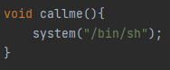

# Alloca
## Analysis

The program starts by claiming that buffer overflow is easy to prevent, and that it can demonstrate how.
Then, it asks for the maximum length of the buffer in bytes.
This is stored in the global `size` variable.
Let's notice that we can enter a negative value for `size`, causing unexpected behavior.
I entered size -8, and received:

Then, the user should enter some canary value (will be used to validate that no BOF has occurred).
This will be stored in the global `g_canary` variable.

Then, the `size + 4` (4 for the canary) buffer is allocated on the stack using `alloca`.
A pointer to this buffer is stored in the global `buffer` variable.
The use of `alloca` can fail with undefined behavior without the user knowing about it.
If we can limit the size of the stack, we can exploit it.

Finally, we are provided with the `callme` function which activates a shell.

## Negative Size
I wanted to check the effect of entering a negative size.
I entered negative size values while debugging with GDB until I noticed a segmentation fault.
I saw that when entering -36, I received the segmentation fault in `lea esp, [ecx-0x4]`, 
which comes immediately before `ret` from `main`, which is excellent, since it means we might have control over the program execution flow.
Specifically, the value of `ecx` was 0xffffffdc, which is exactly -36.
If we can enter a value so that the received memory address will contain a pointer to `callme`, we'll activate a shell.
However, I did not manage to continue this pattern, as -52 broken it with another value.
After some more experimentation, I entered a size of -76 and received the value of the canary in `ecx`.
This means that we want the canary to be a pointer to somewhere that points to `callme`.
However, how can we know where there is a pointer that points to `callme`?

## Stack Spray
I did not find any bytes in the binary that corresponds to the address of `callme`.
This means that we cannot have a deterministic solution here.
However, if we spray the stack with the address of `callme`, and then have a "guessed" address in the stack in the canary,
we might direct the execution to `callme`.
I created a script that sprays the address of `callme` on the stack using environment variables.
After enough tries (about 20), I succeeded.

## Exploitation Summary
1. Spray the stack of the executable with the address of `callme` via an environment variable.
2. Enter a negative buffer size (-76).
3. Guess a stack address via the canary.
4. Bruteforce until the guessed stack address lands on an address of `callme`.
5. Profit.
