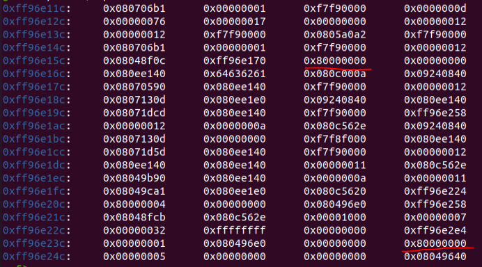

# ASCII
## Analysis
The program starts by mapping 4096 bytes of executable memory to address 0x80000000.
Then, it receives 400 characters from the user in a loop, while validating that every character is ASCII.
Finally, a bug is triggered in the `vuln` function.
`vuln` has a 168-byte buffer on the stack, and it uses `strcpy` to copy the previously mapped memory to the buffer.

## Code Execution
As far as I'm concerned, it looks fairly similar to my solution to `ascii_easy`.
Maybe I over-complicated things in `ascii_easy`, but let's try to redo our logic from there.
First thing I noticed is that the ascii limitation here might make our life much harder than in `ascii_easy`, 
because all the addresses in the binary do not pass the ASCII limitation.
What can we do then?
I noticed that in the input loop, the user can enter a single non-ascii character, which is a bug, but I'm not sure how it helps me.

Fair to assume, we can control the return stack pointer/instruction pointer of `vuln` to some extent.
How can it help us though?
The return from `main` comes immediately after the return from `vuln`.
This means that by controlling the return base pointer from `vuln`, 
we can control the return instruction pointer from `main` (recall Simple Login challenge).

Let's put a breakpoint at the return from `main` and see if we find pointers in the stack to the mapped memory.



And here we have it, both at `$esp - 0x14` and `$esp - 0xf8`.
This means that if we manage to decrease the value of the return base pointer in `vuln` by 0x14 or 0x8f
we'll redirect the execution to the mapped memory.

The problem here is that we do not know necessarily the value of the return base pointer in `vuln`.
All we can do is guess...
What we do know (from observation), is that the last nibble of the return base pointer will be 8.
If we manage to zero this nibble when the whole byte is 0xf8, we'll manage to redirect the execution to the mapped memory.
The probability for this scenario is 1/16, which is good enough.
To do so, we'll put a non-ascii character in the 168 input character.
Then, `strcpy` will overwrite the least significant byte of the return frame pointer of `vuln` to zero.
I tried this payload a few times and saw in GDB that I indeed managed to redirect the execution to 0x80000000.

## Alphanumeric Shellcode
Then, I searched google for an ascii `execve("/bin/sh")` shellcode and found that is small enough to fit into the buffer - 
https://blackcloud.me/Linux-shellcode-alphanumeric/.
However, the shellcode caused a segmentation fault.
After diving a bit more into the shellcode, I realized that the given shellcode should be adjusted in order to actually work.
That's because in the last stage of the shellcode, in order to jump to `int 0x80`, 
it pushes this instruction onto the stack and then uses `jmp esp`.
We cannot do that because `jmp esp` is not alphanumeric.

My first idea to solve this problem was to look for `int 0x80` in the binary 
and try to use the limited alphanumeric instruction set to jump there.
I found a few occurrences, but they were too far from 0x80000000, given that my only way to jump was using a jump short opcode,
which can advance the instruction pointer by not more than 127 bytes at a time.

My second idea was to move the stack to an absolute address before executing the shellcode.
That way, we won't need to use `jmp esp` as we'll already know the address of the stack.
And when I say "absolute address", I mean an address inside the buffer, so we could easily jump into it.
I looked at the possible alphanumeric opcodes, 
and realized that the best way for me to modify `esp` is using `xor esp, [eax + offset]`.
In order for this opcode to be alphanumeric, the offset should be alphanumeric as well.
In addition, while debugging, I saw that in the beginning of the execution of the shellcode,
`ecx` contains the value 0x800000a0.
Overall, the following opcodes relocates `esp` to 0x800000a8:
```
push esp
pop eax
push esp
push ecx
dec eax (0x28 times)
.
.
.
dec eax
xor esp, [eax + 0x20]
xor esp, [eax + 0x24]
```

Then I ran the exploit after the stack relocation, but it failed again.
The reason for that was that I needed to make sure that `int 0x80` was in the top of the stack.
If it wasn't, then I had garbage opcodes that would get executed after the shellcode, 
that were left over after pushing to the relocated stack.
In order to solve it I needed to make some modifications to the alphanumeric shellcode.
Finally, it should be mentioned that we should add a NOP sled before reaching the pushed `int 0x80`.
I used the alphanumeric `inc edi` as my NOP instruction.
The final ASM is attached.

After some intense debugging, I finally made the shellcode work.
A Python script that prepares the payload is attached.
`./ascii < payload` terminates the shell immediately so in order for the shell to stay interactive we should use
`cat payload - | ./ascii`.
And that's it :)

# Summary
1. In order to get code execution, the 168 byte of the input should be non-ascii, leading to execution to our shellcode in probability of 1/16.
2. When the shellcode starts to run, it should start with relocating the stack to the end of the buffer.
3. Then, the alphanumeric shellcode should run, modified to push `int 0x80` to the top of the stack.
4. Add a NOP sled until we reach the pushed `int 0x80`.
5. Profit.
