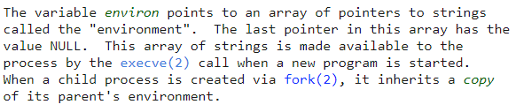
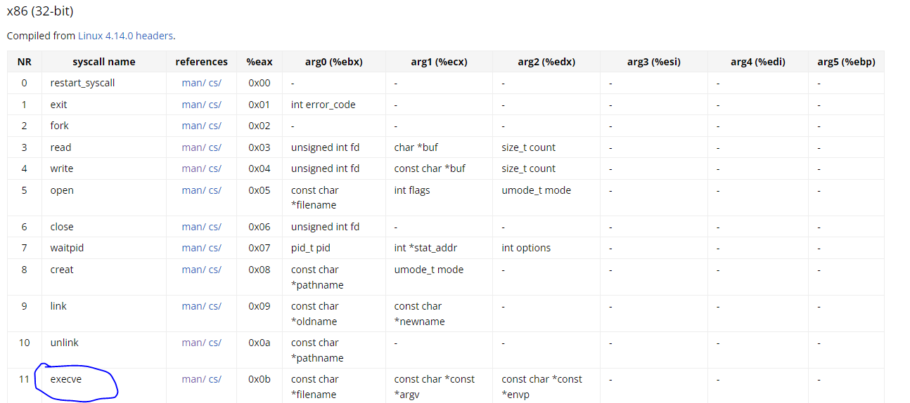
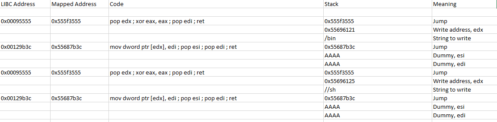
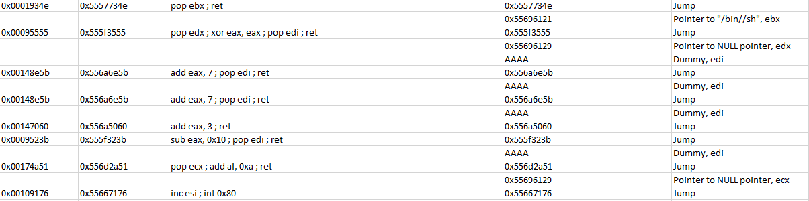

# ASCII Easy
## Static Analysis
The program receives its input through the command line.
It starts by validating there is only one argument.
Then, libc is mapped to memory to a constant address.
Afterward, every byte of the input is checked to be ASCII using the `is_ascii` function.
Finally, a bug is triggered using the `vuln` function.
The `vuln` function copies the supplied input to a buffer on the stack using `strcpy`.

## Vulnerability
The vulnerability is obvious here.
`vuln` function performs `strcpy` from the supplied input to a buffer on the stack, 
which causes an overflow into the return instruction pointer and the return frame pointer of `vuln`.
However, our input should be all ASCII, which makes it hard for us to return to our desired address,
because every byte of out input should be between 0x20 and 0x7f, included.

## Failed Try - `environ` trick + return to `execvp`
When I calculate the address of `system` (constant address of memory mapping + libc offset), the received address is 0x5559ced0, 
which does not align with our ASCII limitation.
We can probably find some other function that will help us with opening a shell - `execvp` will do the trick, and it passes the ASCII limitation.

Now, we should find a way to pass arguments to `execvp`.
The signature of `execvp` is as following: `int execvp(const char *file, char *const argv[]);`
`file` should be a pointer to the name of the executable we run, which is `/bin/sh`, and `argv` should be `{"/bin/sh", NULL}`.
So we cannot write `"/bin/sh"` directly to the stack, we should find a pointer to it.
This string offset in libc does not pass the ASCII limitation, unfortunately.
After reading a bit more in the documentation of `execvp`, I discovered that if the supplied filename does not contain a "/" character,
then `execvp` will search for it in the defined `$PATH` environment variable.
Therefore, we can find a simple NULL terminated string in the ASCII limitation address space,
then create a file in `tmp/my_folder` that has the above simple string as its name, and a shell script that opens a shell as its content.
I found the string "A" in address 0x556B3f5C, so we'll use that address in our payload, and the file name will be "A".
We'll define `$PATH` to search in `tmp/my_folder`, and a shell will be opened.

Unfortunately, the above didn't work.
A segmentation fault was triggered in the access to environ, because the value of `environ` is not updated during the memory map:

## `execve` syscall

The failed try led me to realize that just overriding the return instruction pointer won't be enough here.
The `environ` problem mentioned above cannot be simply solved, as the only functions that allow us to set it to `NULL` are `execle` and `execvpe`,
both do not pass the ASCII limitation.
So we don't have any function to call, what can we do?
We can call `execve` via a syscall.
syscalls can be triggered by the ASM command `int 0x80`, with the EAX register determining which syscall is called and other registers determining the arguments to the syscall.
We can trigger `execve` using the below register values.

But how can we do this using just a buffer overflow on the stack?

## ROP Chain
So we want to execute the `execve` syscall.
In order for this to happen, we need the following things to take place:
1. `eax` should have the value `0x0B`.
2. `ebx` should contain a pointer to `"/bin/sh\0"`.
3. `ecx, edx` should point to a NULL pointer.
4. `int 0x80` should be called.

We can do this by constructing a ROP chain with the appropriate gadgets.
We'll remind that every value we put on the stack should pass the ASCII limitation.

I used the `ROPgadget` program over the supplied binary of libc.
I filtered all the gadgets using a Python script only for gadgets that will pass the ASCII limitation.

The first thing we would want to do is to have "/bin/sh" in an address that pass the ASCII limitation.
I found 10 NULL bytes in the address 0x138121, which is mapped to 0x55696121, so we can use this address.

I constructed the following gadgets to write `"/bin//sh"` to my desired address (the double "//" because 4 bytes are transferred at a time).

Then, I updated `ebx` with a pointer to the `"/bin//sh"` string, I put pointers to NULL in `ecx, edx` and put `0xb` in `eax`, and straight afterwards, call to `int 0x80`.

Success :)
