# ASG
## Analysis
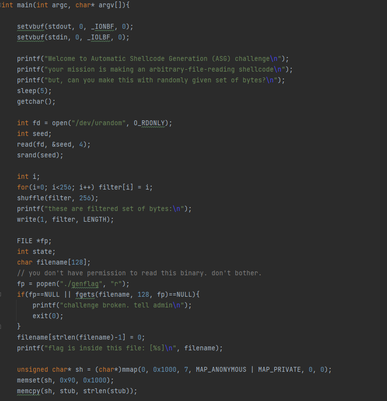

The stub that is copied into the start of the shellcode zeroes the registers (except for the stack pointer).

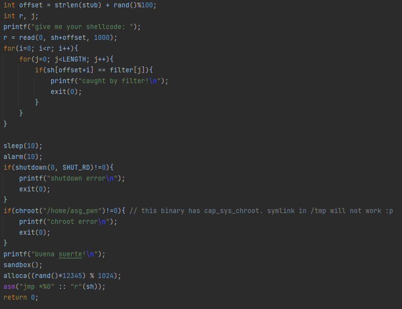

Then, the shellcode is filtered.
In order to succeed, we should bypass the filter.
Between the stub and the actual shellcode there is at most 100 bytes of NOPs, but the actual number is random.
The filter allows only half of the possible 256 bytes (`LENGTH` is 128),
and we know what are the filtered bytes before supplying the shellcode.

## Thought Process
Recalling my solution to `asm`, we have the same `sandbox` here, so the shellcode that should run is
```
shellcraft.open(file_name) +
shellcraft.read('rax', 'rsp', length) +
shellcraft.write(1, 'rsp', length) +
shellcraft.exit(0)
```
However, we cannot just run this shellcode, because of the filtering mechanism.
In order to bypass the filtering, we should think of our shellcode in two states - compressed and uncompressed.
the uncompressed shellcode is the above, the main "beef" of what we run.
The compressed shellcode is a shellcode that bypass filtering, and consists of two parts:
1. Compressed payload - which consists only of bytes that pass the filtering. It should be noted that the compressed payload may be bigger than the uncompressed shellcode and this is just for explaining sake.
2. Compressed core - raw bytes that won't necessarily pass the filtering, and are responsible for taking the compressed payload and decompressing it.

Combining all the parts together - the compressed core will run and decompress the compressed payload.
Then, the execution will jump to the uncompressed shellcode, which is our desired "raw" shellcode.

It is important to note that the proposed solution might be probabilistic, depending on the implementation of the compressed core,
which as mentioned might not pass the filtering everytime and might require some brute-forcing until the list of filtered bytes will comply with the compressed core.

## Compression Mechanism
The proposed compression mechanism should satisfy the following conditions.
First, the mechanism should be as simple as possible, as the compressed core, 
which contains the decompression algorithm, might contain bytes that won't pass the filtering, 
and we want the bruteforce to be as fast as possible.
Second, the input for the decompression algorithm is the compressed payload, 
which consists only of bytes that pass the filtering.
We should therefore think on some relatively simple arithmetic operation,
that takes bytes that pass the filtering and maps them onto all the possible bytes.

What I eventually came up with is a simple addition operation.
Every possible byte can be potentially represented as an addition of two legal bytes.
This statement might not be mathematically full-proof, for example if the legal bytes are all the even bytes.
However, statistically, it's good enough for our use-case - 
a conclusion I reached from observing the result of taking random legal bytes sets,
and trying to use them to cover the whole possible byte range.
The calculation on a given legal byte set was performed as follows:

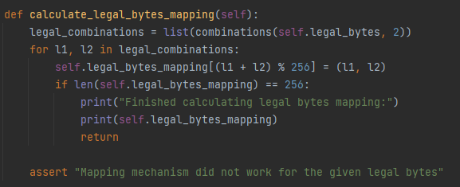

## Stack Relocation
The shellcode starts by running the stub which zeroes out all registers except for rsp.
This is important as we can use the stack in the beginning of our shellcode.
As described, we'll want to decompress our shellcode and then move the execution to the decompressed payload.
A convenient way to do this is to push the decompressed payload to the stack and then jump to the stack.
However, the NX bit is enabled for this binary, which does not allow us to easily run code from the stack.

In order to solve this, we can start our shellcode by relocating the stack to the executable mapped memory.
We do not know the address from which the shellcode will run, so I used a trick in order to do so.
I performed a call opcode to the next instruction, i.e. a call relative opcode with offset zero.
The call opcode causes the address of the next instruction to be pushed to the stack, 
which will be popped from the stack when returning from the function to return the execution back from the callee function to the caller function.
But instead of returning, I explicitly performed a `pop rsp`, and now the stack is relocated to the executable mapped memory.

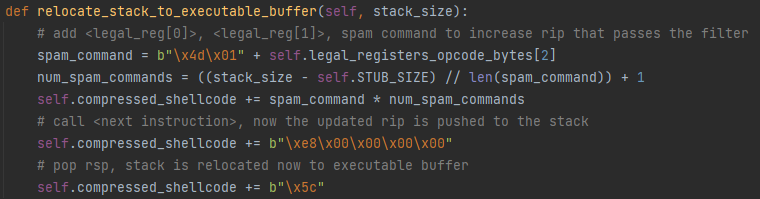

Context:

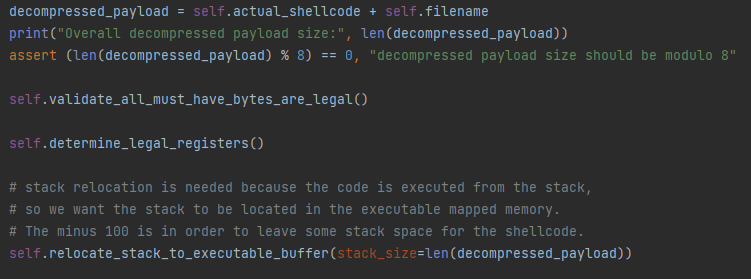

The spam command is a command I started the shellcode with that don't have any purpose rather than taking space in the buffer.
We want to take space in the buffer in order to allow some stack space in the buffer, to be used by the decompressed shellcode.
Because we are still in the compressed core part, I couldn't do with a NOP opcode because of the byte filtering, 
so I used the mentioned spam command instead, which will become clearer later in the writeup.

NOTE: After continuing my writeup, I noticed that the shellcode stack is below the actual shellcode, 
so the spam command part is not necessary at all and can probably be discarded.

## Compressed Core - Flow
Now we can conveniently push our decompressed payload to the stack.
The opcodes that push the decompressed payload to the stack and then jump to the stack should be as minimal as possible,
because if these opcodes do not pass the filter we should try again and bruteforce the server until we get legal bytes that we can work with.

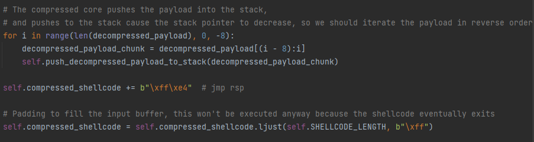

This is the general flow of the compressed core.
We push our decompressed payload to the stack in chunks of 8 bytes.
The stack grows upside and code is executed downside, so we should push to the stack in reverse order.
After finishing pushing the decompressed payload to the stack we jump to the stack.
We should also mention that the decompressed payload consists of the actual shellcode that will run + the filename, 
which we receive initially from the server, and we should send it alongside the shellcode.

## Compressed Core - Chunk Processing
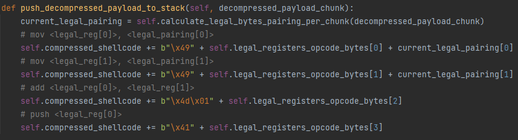

First, each 8-bytes chunk should be split into a pairing of 2 different 8-bytes, whose addition will result in the original chunk.
This is according to what was described under "Compression Mechanism".
Then, the first pairing chunk will be moved to reg_0 and the second pairing chunk will be moved into reg_1.
An add opcode will be performed and finally reg_0 will be pushed to the stack.

One thing that may sound unclear from the above is what are reg_0 and reg_1?
I tried to rely on as little amount of bytes for the compressed core as I possibly can.
Therefore, I realized that the registers used for this calculation can be dynamic, according to the given legal bytes set.
I created a mapping that takes every possible combination of the r8-r15 registers, 
and tells what are the bytes that will be used accordingly in the mov, add and push opcodes.
Here is an example for part of this mapping:

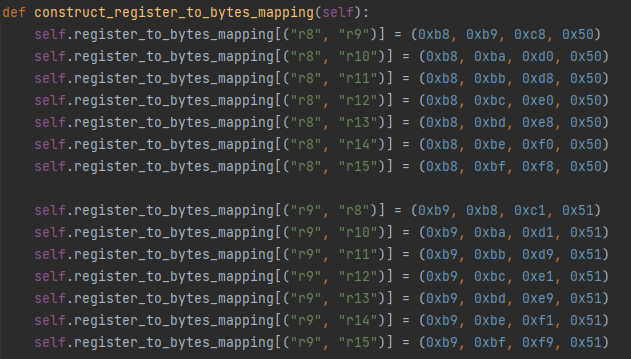

And here is the code that determines the registers we want to use:

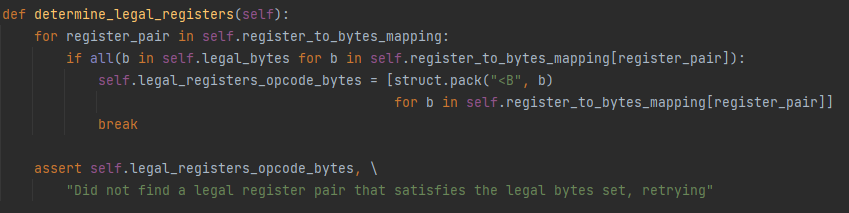

## Compressed Core - Server Bruteforce
So we managed to construct a compressed core that moves execution to our actual desired shellcode.
However, in order to construct the core, we rely on a few specific bytes.
After every connection to the server, we should validate that all of these bytes are legal, 
and if not, we should reconnect and try again, brute-forcing until we're satisfied with the legal bytes set.
There is a 5-seconds sleep after the server connection until we receive the legal bytes set.
These are the must-have bytes:

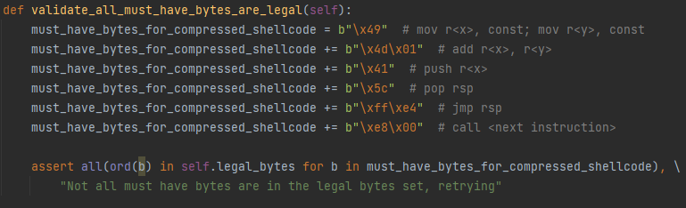

We have 9 bytes, which means will need about 2^9 == 512 attempts on average.
512 attempts with 5 seconds of sleep gives us 2560 seconds == 42 minutes.

## Decompressed Shellcode
As mentioned, the shellcode should be open + read + write + exit.
When the decompressed shellcode starts to run, the stack pointer == the instruction pointer, 
and the filename is located in the buffer after the shellcode.
We would want to start our shellcode by correcting the stack pointer to point to the filename.

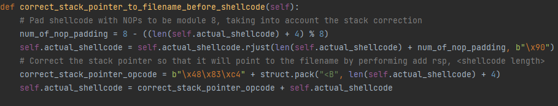

Here, I make sure to increase the stack pointer so that it will point to the filename, 
and also make sure to pad the shellcode with NOPs so that it will properly divide into 8-byte chunks 
(the filename length is 72, so it is already fine for us).
The actual shellcode is pre-constructed as following:

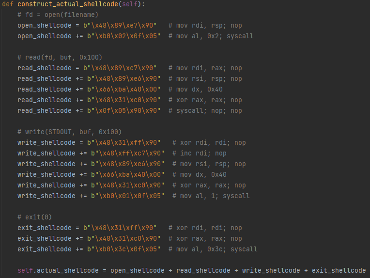

After the exit syscall is performed, we're finished and can enjoy our flag :)

NOTE: The NOP padding in the actual shellcode is probably unnecessary.
All that is necessary is the NOP padding after the shellcode is calculated, and not in every line of the shellcode.

## General Musings
This was a hard challenge, not just in terms of the process itself but also because of the bruteforce aspect, 
and the difficulty in testing and debugging your solution.

In order to be able to debug my solution I took the original binary and patched it in order to run it locally.
I ran my exploit once on the server without the must-have-bytes validation in order to receive a shellcode.
Then I copied the resulted shellcode into a file.
In my local setup, I had to rename the filename in order to match the filename in the shellcode.
In addition, I created a `genflag` binary that reads my local `flagbox` directory and outputs the filename in there.
In terms of patching, I patched every annoying part of the binary with NOPs so that I can run it, 
for example I removed the bytes filtering. 
Finally, the result is that I could give the pre-mentioned shellcode file as input to the binary,
and run it successfully so that my local flag is printed.
