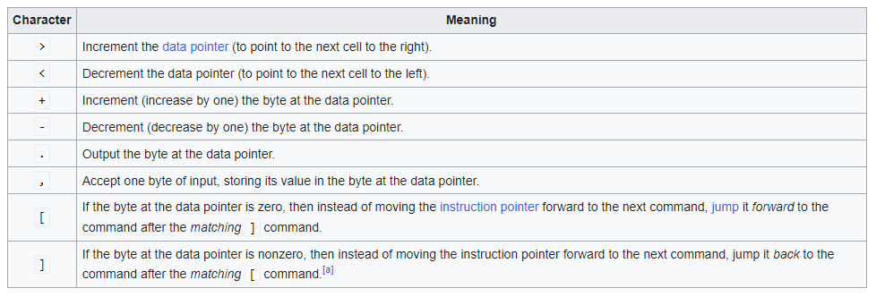
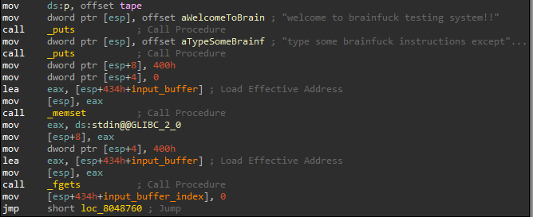
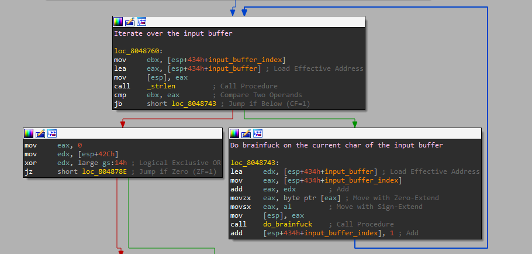
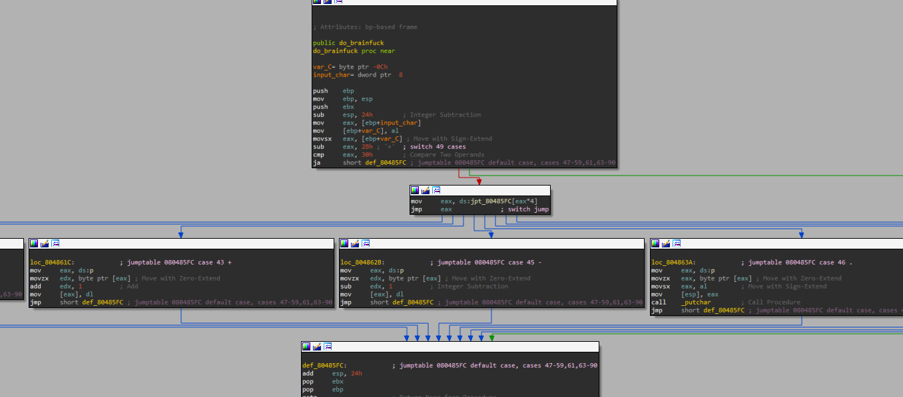
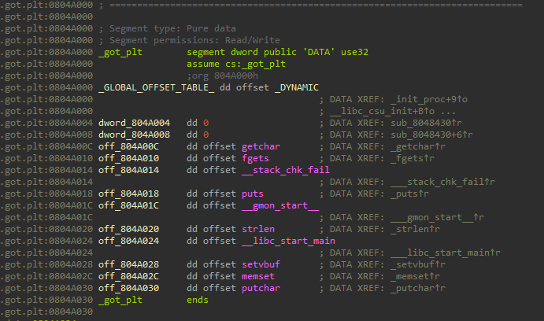
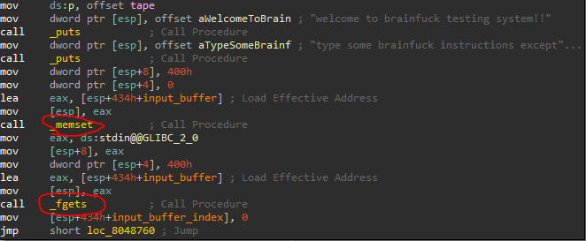

# Brainfuck

## Introduction
We are given a simple brain-fuck language emulation program written in C. 
The [ ] commands are not implemented yet.
We should find a bug and exploit it to get a shell.

## Static Analysis
I started by learning about brainfuck.
It's a simple programming language, that maintains a data pointer and allows the following operation on it:

Now let's open the binary in IDA and do some static analysis.
The program starts by printing a welcome message to the user and then reading the user input, 
which is some brainfuck code, into a buffer:

Then, the emulator evaluates the brainfuck code character by character, until it's done:

Then, I continued looking at do_brainfuck and saw that it's a simple switch-case based on the evaluated character:

## Vulnerability
The code is pretty straight-forward, and so is the vulnerability:
Using the brainfuck language, we can traverse the program's memory (using brainfuck's "<>"), read the memory (".") 
and write arbitrary values to the memory (","), as there isn't any validation about the address of the data pointer, 
which resides in the BSS section.

## GOT.PLT Overrides
So we can write arbitrary values into memory, but eventually we should run `system("/bin/sh")`, how can we do so?
I noticed the `got.plt` section:

Potentially, we can overwrite values in `got.plt` so that they will point to other functions instead of the intended functions.
Then, we can control the flow of the program to run our "malicious" functions so that we'll eventually run `system("/bin/sh")`.
Our potential functions to override are the functions that are called during the emulation of the brainfuck code:
`putchar` (".") and `getchar` (",") cannot serve our purpose because `system` receives a string argument, 
and these functions do not.
`puts` ("[") could be interesting, but it's called with a read-only argument, 
so we cannot modify the argument to be `"/bin/sh"`.
If we overwrite one of these functions with `main` (let's say `putchar`), 
we can extend the scope of our potential functions.
Let's look back at `main`:

We can overwrite `memset` to be `gets` so that we can input `"/bin/sh"` into the input buffer,
and then modify `fgets` to be `system`, and basically that's it.

## LIBC Address Resolution
Just one missing piece before summarizing the exploit.
`libc` is dynamically linked to the binary, which means that we cannot know the addresses of `libc` functions in advance.
However, by leaking an address in `libc`, and knowing its offset from the base of `libc`, we can infer the base of `libc`,
and then infer any other function in `libc`.

## Exploit Summary
1. Traverse the memory using brainfuck to the offset of `fgets` in `got.plt`.
2. Leak `fgets` address using brainfuck.
3. Calculate `libc` base according to the leaked address.
4. Write the address of `system` to `fgets`.
5. Traverse to `memset` in `got.plt` and write the address of `gets`.
6. Traverse to `putchar` in `got.plt` and write the address of `main`.
7. Activate main again using "." (result of section 6).
8. input `"/bin/sh"`
9. Profit.
