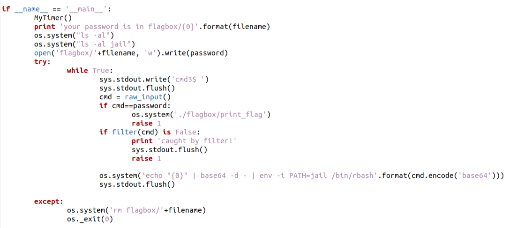
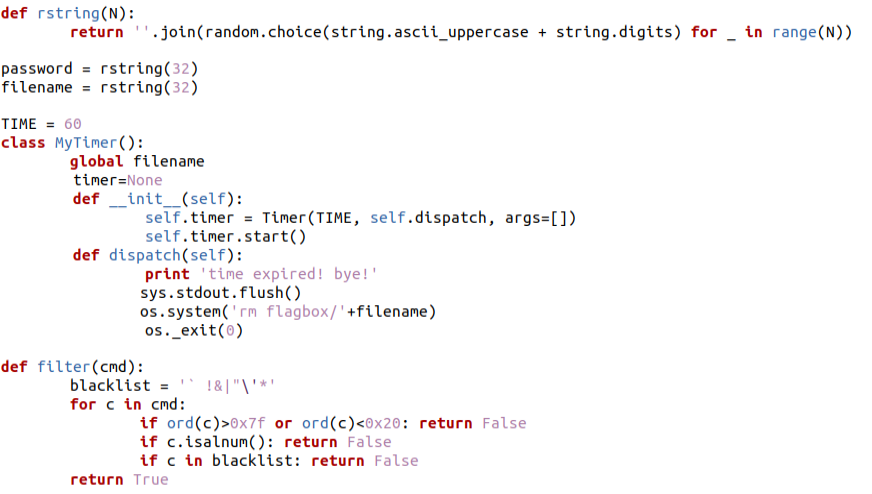
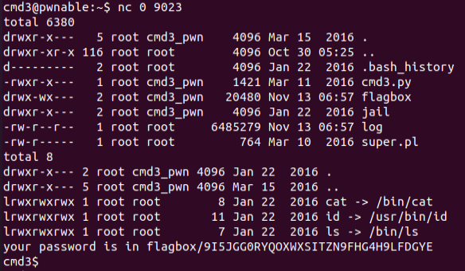

# CMD3
## Analysis

The program runs from a shell server.
It starts by generating the filename in which the password is stored.
The filename is randomly generated using a combination of uppercase letters and digits in length 32.
Then it runs both `ls -al` and `ls -al jail`.

jail is a directory that contains symbolic links to /bin/cat, /usr/bin/id and /bin/ls.

Then, the password is written into the file, which is randomly generated exactly as the filename is.

The user should then enter its command for the shell.
if the command is the same as the generated password, `flagbox/print_flag` will run.
Otherwise, the command must pass the filter, 
which validates that the command is ASCII without alphanumeric characters and without characters that belong to blacklist = ` !&|"\'*.
This means that these are the valid characters: '#', '$', '%', '(', ')', '+', ',', '-', '.', '/', ':', ';', '<', '=', '>', '?', '@', '[', '\\', ']', '^', '_', '{', '}', '~'.
Then, the command is passed to rbash, which is a shell that restricts the execution only to the defined path, 
which is the jail directory.

## Solution
Our goal is to perform `cat flagbox/<password_filename>`.
Then, when we know the password, we can give it as an input to the shell, and we'll get the flag.
In order to simplify my work in constructing the shell command, 
I thought that after getting the password filename from the restricted shell,
I can create a file in /tmp called '_-\_-' (underscore hyphen underscore hyphen), 
which is part of the restricted characters set, 
which will contain the content `cat /home/cmd3_pwn/flagbox/<password_filename>`.

Then, I should only find a way to trigger this file from the restricted shell.
So what I essentially want to perform in the restricted shell is `$(cat /tmp/_-_-)`.
We should find a way to engineer this command using only the restricted characters.
Our problem is in "cat", "tmp" and the space character.
At this point I was pretty clueless, 
so I searched google for "bash special characters" for some inspiration regarding my restricted characters set.

I know that I can create some array using the restricted characters set, for example `__=({+,+})` (array with 2 plus signs).

If I can join the elements of the array using a space delimiter and get a specific index from the array I can create a space character.
I learned that I can do so using the following bash: `${var_name[@]}`.
Therefore, `___=${__[@]}` gives us the string '+ +' (with an important space in index 1).

Indexing a string in bash works as following: `${var_name:start_index:length}`.
So in order to get a space I need to do `${___:1:1}`.
How can we get '1'?
I learned that the PID (process ID) is stored in `$$` and that I can evaluate arithmetic operations using `((...))` 
(double brackets), so we'll have `____=$(($$/$$))`
Now, `_____=${___:____:____}` is the space character!

In order to get `cat`, we know that cat is in the jail directory.
We can use wildcards `????/???` to get `jail/cat`.
We can get string indices again, `${______:5:3}`.
We'll define `_______=$((____+____))` (2=1+1), `________=$((_______+____))` (3=2+1), `_________=$((________+_______))` (5=3+2).
And now, `${_:_________:________}` is `cat`.

Finally, `/tmp/_-_-` can be achieved using wildcards as `/???/_-_-`, which means that the final command can be achieved using
`$(${_:_________:________}${_____}/???/_-_-)`.

The total shell command payload is:
`__=({+,+});___=${__[@]};____=$((($$/$$)));_____=${___:____:____};_______=$(((____+____)));________=$(((_______+____)));_________=$(((________+_______)));????/???;$(${_:_________:________}${_____}/???/_-_-)`
