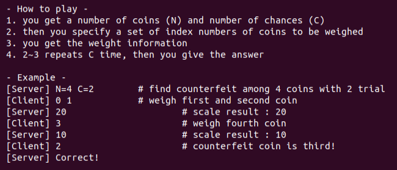
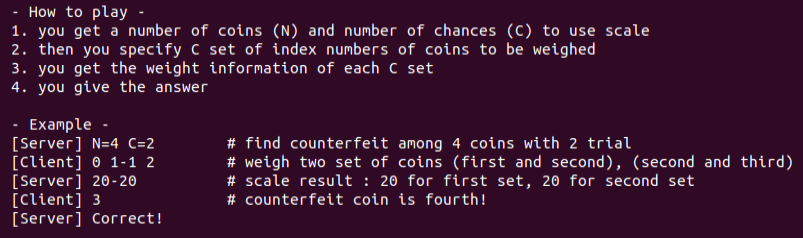

# Coin2
## Analysis
Let's start by recalling coin1.
In coin1, we had a game where we needed to find the counterfeit coin:

We managed to find the counterfeit coin by performing binary search, as `2^C > N` was always true.

In this game, the format is different:

In coin1, in each chance, we could weigh as many coins as we wanted.
coin2 is identical, with the difference being that all weighing requests are performed once,
which means that we cannot accumulate knowledge between weighing requests.
I started to think about a solution, with a sense that it will probably have a mathematical-logical nature.
After some time, I had an idea.

## Solution
The observation that `(2^C > N)` exists here as well.

Therefore, each coin can be represented in binary as `c_1, c_2, ..., c_C`.
For example, for `N=8, C=3`, the coin 5 will be represented as `0b101 -> c_1 = 1, c_2 = 0, c_3 = 1`.

Now, we could split our coin universe to `C` sets in the following way.
We'll have `S_1, S_2, ..., S_C`, so that `S_i = {c in coins | c_i = 1}`.

Afterwards, we'll receive the weights as `w_1, w_2, ..., w_C`.
We'll define `a_i = w_i % 10` for each weight.
The counterfeit coin will be `a_1, a_2, ..., a_C`.