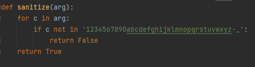
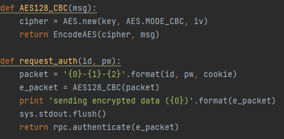
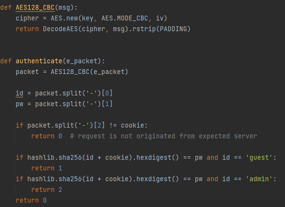
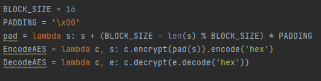
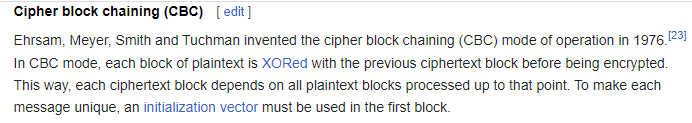
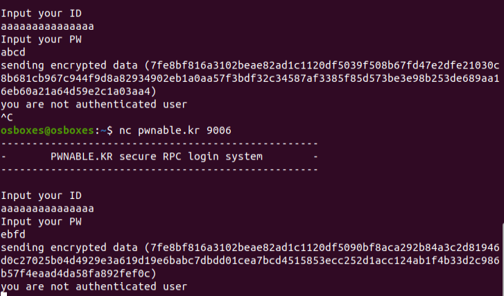
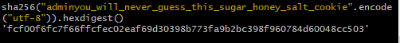
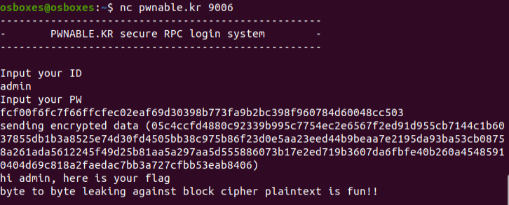

# Crypto1
## Analysis
The client program starts by getting an ID and password from the user.
Both of the inputs are validated using the `sanitize` function, which makes sure that every character of the input is in a specific set.

Then, `request_auth` is called, which authenticates to the server.

As we can see, the authentication packet is constructed in a `<id>-<pw>-<cookie>` format.
The ID and password are controlled by the user, but the cookie is hidden,
This format is then encrypted and sent to the server.
The encrypted packet is also printed to the screen.

Let's investigate the server logic.

The server decrypts the data, then splits it into ID, password and cookie.
It starts by validating the cookie.
The password should be equal to `sha256(id + cookie)`.
In order to pass the password validation, we must discover the cookie.
After we discover the cookie, we can calculate the password of the admin user and authenticate successfully.

## Crypto Vulnerability
Let's dive into the encryption mechanism.

As we can see, the encryption is in CBC mode, with block size of 16 (AES_128).
CBC means that the data is encrypted in blocks.

Indeed, when I give an ID of "a" * 15 it means that the first block should be constant, and I can see that in the encrypted data:

We can also see that for some reason, the usage of "-" is allowed in the input, 
but it is also used to separate the data before the encryption (id-pw-cookie).

We know that the first block is 16 bytes, so what if we give "a" * 13 as an ID and give an empty password?
We'll receive aaaaaaaaaaaaa--<first char of cookie>.
However, we can make the first block look exactly the same by giving the same ID but the password "-<first char of cookie>".
We still don't know what the first char of cookie is, but we can bruteforce it from the possible set of input characters.
After we discover the first cookie character, we can use "a" * 12 and continue to the next cookie character, 
and so on until we discover the full cookie (when the first block becomes full we'll do the same on the second block and so on).

Using the attached bruteforce script, I discovered that the cookie is "you_will_never_guess_this_sugar_honey_salt_cookie".
Therefore, the password is:

And finally:

