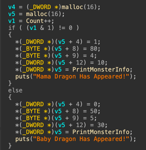
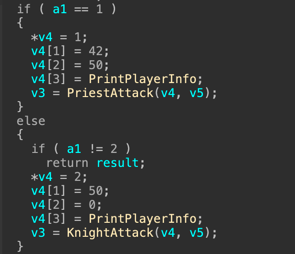
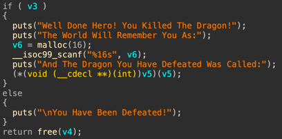
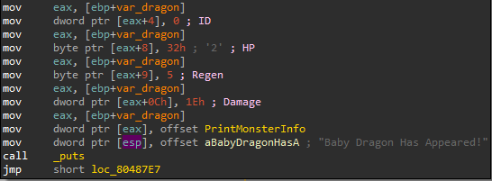
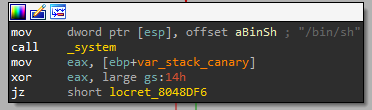

# Dragon
## Flow Analysis
The game is started with a welcome message, and then the function `PlayGame` is called.

The function `PlayGame` is consisted of an infinite loop.
In each iteration, the player is requested to choose his hero (`GetChoice`) - 1 for priest or 2 for knight.
Then, the function `FightDragon` is called with the requested hero as an argument.
However, the user can also choose 3 and enter `SecretLevel`.
Any other choice causes the game to finish.

`SecretLevel` uses `scanf("%10s")` to get a 10 character password from the user.
If the string is `Nice_Try_But_The_Dragons_Won't_Let_You`, a shell is granted, otherwise the program exits.
We should note that since the input is limited to 10 characters, it should be a challenge to make the string as requested to grant a shell.

`FightDragon` starts by `malloc`'ing 16 bytes for hero and dragon.
Then, the global `Count` is incremented, and according to its value, it is determined whether the current dragon is mama dragon or baby dragon.

Then, the fighter struct values are initialized, and the appropriate attack function is called.

The function ends with the following:

In `KnightAttack` and `PriestAttack`, there is a loop, and in each iteration an appropriate action for the attacker type is chosen by the user.
Each such operation affects the dragon and the attacker.
This loop continues until either the attacker or the dragon dies.
Eventually, the dragon is freed, and either 0 or 1 is returned according to the fight result.

## Game Operations Analysis
To sum up, in each iteration of the game, the user chooses whether he is a knight or a priest.
Let's break down the possible outcomes of each choice.

Mama dragon: 80 HP, 4 Regen, 10 Damage.
Baby dragon: 50 HP, 5 Regen, 30 Damage.

Knight: 50 HP, 0 MP.
Operations:
1. Crash: Deals 20 damage to dragon, then dragon deals damage to you and regens.
2. Frenzy: Deals 40 damage to dragon, then dragon deals damage + 20 to you and regens.

Priest: 42 HP, 50 MP.
Operations:
1. Holy Bolt: Costs 10 MP, deals 20 damage to dragon, then dragon deals damage to you and regens.
2. Clarity: Recharges MP back tp 50, then dragon deals damage to you and regens.
3. Holy Shield: Costs 25 MP, no damage is caused to either side, and the dragon regens.

### Knight Vs Mama Dragon
1. Crash: Deals 16 damage to dragon (after regen) and 10 damage to you.
2. Frenzy: Deals 36 damage to dragon (after regen) and 30 damage to you.

Overall, there is no way for the knight to beat mama dragon.

### Knight Vs Baby Dragon
1. Crash: Deals 15 damage to dragon (after regen) and 30 damage to you.
2. Frenzy: Deals 35 damage to dragon (after regen) and 50 damage to you.

Overall, there is no way for the knight to beat baby dragon.

### Priest Vs Mama Dragon
1. Holy Bolt: Costs 10 MP, deals 16 damage to dragon (after regen) and 10 damage to you.
2. Clarity: Recharges MP back to 50, then dragon deals 10 damage to you and regens (+4).
3. HolyShield: Costs 25 MP and dragon regens (+4).

Overall, there is no way for the priest to beat mama dragon.

### Priest Vs Baby Dragon
1. Holy Bolt: Costs 10 MP, deals 15 damage to dragon (after regen) and 30 damage to you.
2. Clarity: Recharges MP back to 50, then dragon deals 30 damage to you and regens (+5).
3. HolyShield: Costs 25 MP and dragon regens (+5).

Overall, there is no way for the priest to beat baby dragon.

### Dead End + Integer Overflow + Victory
Simple analysis of the game operation does not lead to a concise way of winning the game.
There is probably something we missed in the analysis.
After diving deeper into the assembly code, I realized that the HP field in `Struct_Dragon` is a single byte.

Therefore, if we manage to increase it enough, we should probably be able actually make it negative.
Indeed, I managed to increase it to 128 by fighting Mama Dragon with the priest.
I used a combination of HolyShield to regen the dragon and Clarity to recharge MP (in order to be able to continue using HolyShield).

So overall, in order to win, the following sequence should be entered: 1111332332332332.
The initial "111" causes the priest to lose to the Baby Dragon and the following choices causes the priest to win the Mama Dragon.

## Dragon Use-After-Free
In both `KnightAttack` and `PriestAttack`, no matter the outcome, the dragon is eventually freed.
However, if the hero manages to kill the dragon, a new memory is allocated and controlled by the user input, and then the dragon is used `(Dragon->Function)(Dragon)`.
Therefore, we have a use-after-free vulnerability, where we have full control over Dragon (16 bytes).
In the secret level, we have a call to `system("/bin/sh")`, so we should make `Dragon->Function` to point to there, and we're done.

The above code block is in address 0x08048DBF.
`Dragon->Function` is the first 4 bytes of `Dragon`.
Therefore, our "hero name" (that exploits the UAF bug) should be this address.

## Summary
1. Win the game using the following sequence: 1111332332332332.
2. Exploit the UAF vulnerability of dragon to point to `system("/bin/sh")` (0x08048DBF).
3. Profit.
