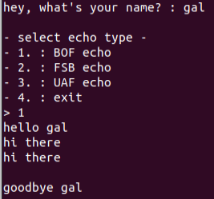
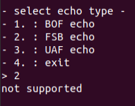
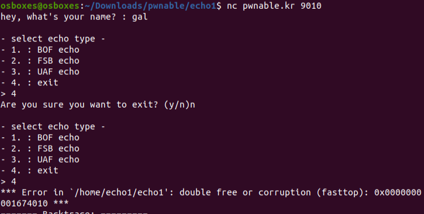
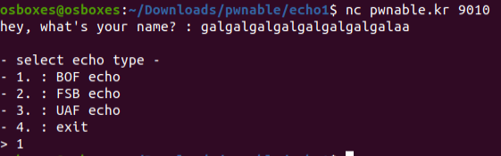
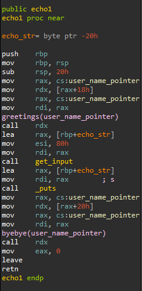
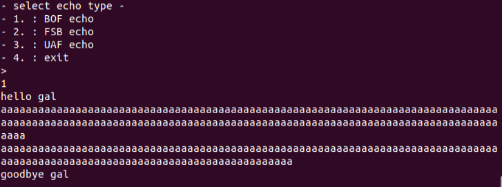
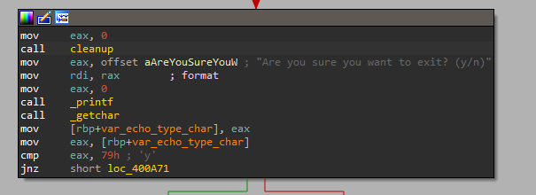
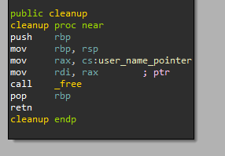
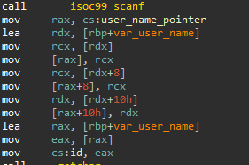

# Echo1
## UI Analysis
The program starts by asking for the user's name.
Then, the user receives an interface where he should choose an echo type between BOF, FSB, or UAF, or he can exit if he wants.
This interface is repeated until exit.
The BOF echo prints the received input.

The FSB/UAF echoes are unsupported.

When trying to exit, the user can reverse its decision as he is asked whether he is sure that he wants to exit.
I noticed that in the second exit try, the program crashes.

In addition, I noticed that when entering a 26 characters username, the program does not really allow you to choose any option and exits immediately (but without any message).

Finally, entering an invalid option prints "Invalid menu".

## Reverse Engineering
I started by looking into the username input.
The username is limited by 24 characters.

The FSB and UAF echoes are indeed empty and not interesting.

The BOF echo indeed causes a buffer overflow.

`get_input` is called with 0x80 characters, while `echo_str` is 24 bytes.

In addition, the `cleanup` function is called even when the user regrets and not exits.

This causes `user_name_pointer` UAF, which I'm not sure how to exploit.

## Exploitation
We have a buffer overflow in `echo1`.
The overflow is big enough for us to write a `system("/bin/sh")` shellcode onto the stack.
However, how are we supposed to execute the code from the stack?
In this overflow, we would want to overwrite the return address of `echo1` to an address with code that will move the execution to the stack.

`user_name_pointer` is a global variable. 
However, it points to allocated memory on the heap, and we have control only on its heap chunk and not on the value of the actual global variable.
I noticed the following `id` global variable:

Its value is determined by the first 4 bytes of the username.
We can overwrite the return pointer of `echo1` to the address of ID.
Then, by entering an appropriate username in the beginning, we can make `id` contain the shellcode `jmp rsp`.
Then, using the same buffer overflow as above, the execution will jump to our `system("/bin/sh")` shellcode.
