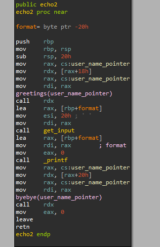
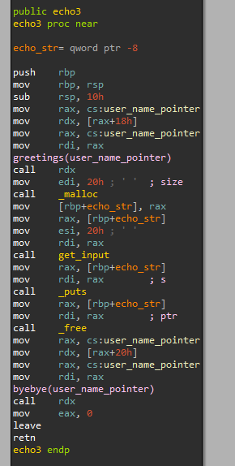

# Echo2
## Analysis + Exploitation
The UI here is basically identical to the UI in echo1.
The important difference is that here, the BOF echo is disabled while the FSB and UAF echoes are enabled.

Here is the FSB echo, which has an obvious FSB vulnerability:

And here is the UAF echo:

The UAF vulnerability allows us to write to the heap where `user_name_pointer` points to, which is freed in `cleanup`.
The new memory allocation allows us to write 0x20==32 bytes into `user_name_pointer`, which is more than the previously allowed 24 bytes.
This way, we can overwrite `greetings` to point to our shellcode.
We can write our shellcode into the stack, when entering the username (later copied from the stack to the heap).
In echo1 my shellcode was too big to fit into username (using `shellcraft`), 
but using a quick google search I found a shorter shellcode which is 23 bytes, which fits into the username.
Finally, when overwriting `greetings`, in order to know the address of the username on the stack, we should leak stack addresses using the FSB.

## Exploitation Summary
1. Send the 23 byte `execve("/bin/sh")` shellcode as the username.
2. Leak the shellcode address using the FSB vulnerability.
3. Activate the `cleanup` and return to the main loop.
4. Overwrite `greetings` with the leaked shellcode address.
5. Activate the shellcode by triggering `greetings` (either choose FSB echo or UAF echo).
6. Profit.
