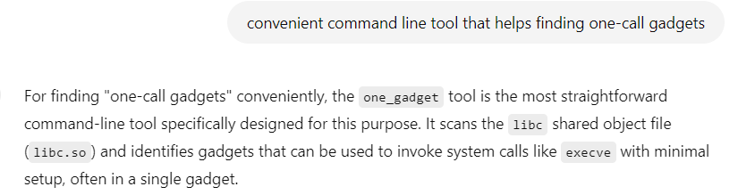
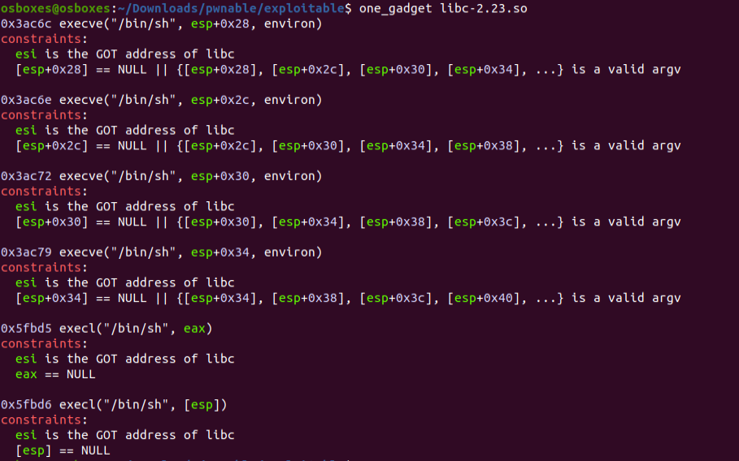

# Exploitable
## Analysis

```
#include <stdio.h>

void leak_memory(int fd, int addr, int len, int key1, int key2, int key3, int key4, int key5, int key6){
	if(key1==0xcafebabe && key2==0xdeadbeef){
		if(key3+key4+key5+key6==14){
			write(fd, addr, len);	
		}
	}
}

void main(){
	int eip;
	int n;
	leak_memory(1, &stdout, 4, 0xcafebabe, 0xdeadbeef, 1, 3, 3, 7);	// leak libc
	scanf("%d", &eip);
	((int(*)())eip)(0xdeadbeef);	// hijack control flow!
}

```

We are given a binary that does the following:
1. Leak an address from libc.
2. scanf an address from the user.
3. Call this address.

So we can jump wherever we would like in the binary given an address leak from libc.
Using the address leak, we can find the base address of libc in the binary and jump wherever we would like in libc.

I took libc-2.23.so and searched for appropriate gadgets.
I used ChatGPT and searched for a convenient command line tool that is intended specifically for one-call gadgets:



I searched for gadgets using one_gadget:



I used GDB to test which of the options is good for me and found that the first option should work.
It indeed worked and I got the flag.

# Summary
1. Calculate LIBC base address using the LIBC address leak.
2. Move execution to the appropriate one-call gadget from LIBC.
3. Profit.
