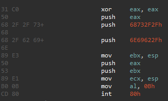
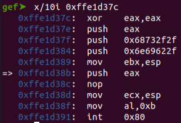
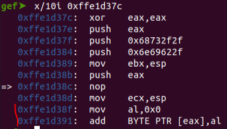
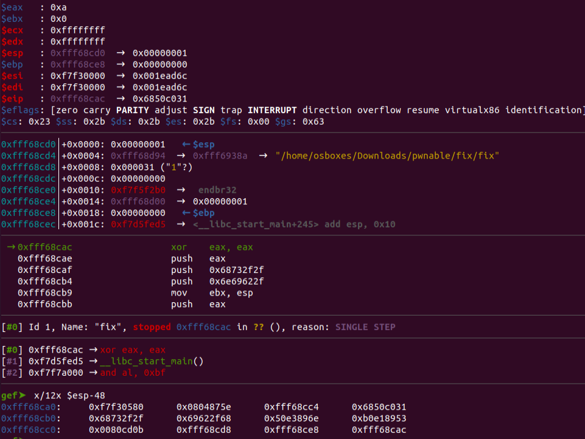

# Fix
## Analysis
The program has a global variable called `sc` that is supposed to be a 23 byte shellcode that runs `execve /bin/sh`.

The program states that there is something wrong with the shellcode and that we should help fix it.
We should enter a byte index that we want to patch (between 0 and 22, inclusive) and then enter its patched value.
The patch will take place, and the `shellcode` function will be called.

`shellcode` starts by allocating a 20 byte buffer on the stack.
This buffer is commented as a "buffer we are about to exploit".

Then, `sc` is copied into this buffer using `strcpy` - "prepare shellcode on executable stack".
Finally, the following line is executed `*(int*)(buf+32) = buf;` - "overwrite return address".

## Segmentation Fault
When trying to run the program as is (not patching any byte in the shellcode), a segmentation fault is received.
I tried to analyze why it happens.
For general reference, here is the shellcode:

I saw that the shellcode is indeed executed, but that after the `push eax` line, the code of the shellcode is modified to some code that does not make sense.
This makes sense, for two reasons:
1. The buffer that contains the shellcode on the stack is initialized with only 20 bytes while the shellcode is 23 bytes.
2. The shellcode runs from the stack, but it also pushes values into the stack.

3. To demonstrate, in the following run, I patched the `push ebx` to `nop` by patching the 16 index to be 0x90.
Before `push eax`:

After:

## Stack Pointer Relocation
In order to prevent the demonstrated segmentation fault from happening, we should think about moving the stack somewhere during the shellcode.
But we have only 1 byte we can patch.
The only reasonable opcode I can think of that can be patched into the shellcode is `pop esp` - 0x5c == 92.
Let's look at the stack during the run of the shellcode, and think where we should insert the patch.

The last line in the image is the area of the stack that will be overwritten during the shellcode.
The last word points two rows upwards in the stack (a pointer to the beginning of the shellcode).
In order to use this address in `pop esp`, we should patch the `push eax` line, but then, "/bin//sh" won't end with a null terminator, so we'll discard this option.

"/bin//sh" must be pushed onto the stack, so we won't patch these lines of the shellcode.
We are left with the `push eax` line, which we must patch, otherwise the shellcode will be overwritten.
So we'll patch `push eax` into `pop esp`, which means that the ecx will point to the new area of the stack (after the relocation).

When first trying this, I got a segmentation fault again.
That's because the stack pointer relocates to 0x6E69622F after the patch, which is a very far address from the original stack pointer, 
and causes the stack to be too big.
In order to allow the stack pointer to relocate to this address, we should use `ulimit -s unlimited`.

## Summary

