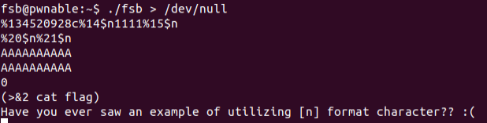

# FSB
## Analysis
The program starts by reading 8 random bytes into a key, which is a global variable.
Then, the program allocates `0x12345 & key` bytes on the stack using `alloca` (not sure why it's in the code).
Then, `fsb(argv, envp)`, with a note telling us to "exploit this format string bug".
In `fsb`, firstly, every character of every element in `argv` and `envp` is zeroed.
Then, the program prompts the user to give a format string, reads the string (maximum 100 bytes) into `buf` which is a global variable, and prints it.
This is repeated 4 times.
Then, the program sleeps for 3 seconds, which is maybe some bruteforce mitigation.
Then, at most 100 bytes are read from stdin into `buf2`, which is then converted to a decimal `unsigned long long pw` using `strtoull(buf2, 0, 10);`.
If `pw == key`, we are granted a shell.

## Exploitation
The vulnerability is explicitly noted in this challenge - a format string vulnerability in `fsb`.

Using this vulnerability, we can leak and write to addresses pointed by the stack.

Let's put a breakpoint before the trigger of the vulnerability - `printf(buf)`.
And let's view the stack during the breakpoint.

We'll want to overwrite `key`, the problem is that it is not pointed by the stack.
However, we can see that the 14 and 15 words on the stack point to the 20 and 21 words on the stack, accordingly.
Indeed, these are pointers to `argv` and `envp`, which are zeroed.

Using these pointers (14, 15), we can write the address of `key`, which is constant in the BSS section (0x0804A060, 0x0804A064),
to the stack (20, 21).
This can be done using the following input: `%134520928c%14$n1111%15$n`.
This format string prints `134520928 == 0x0804A060` characters, then saves this number to the address pointed by the 14 word in the stack, i.e. the 20 word, 
increases this value by 4 (by printing another 4 characters) and write it to the following word in the stack, i.e. the 21 word.

Using the recently written address of `key` to the stack, we can zero `key` - `(%20$n%21$n)`.

This will exploit the format string vulnerability twice, and we don't care about the value in the two remaining inputs.
Finally, the password will be 0.

Since we print a lot of characters to the screen, we'll redirect the output to `/dev/null`. 
Finally, in order to print the flag to the screen after the shell is opened, we'll redirect it to `stderr`.

# Summary

