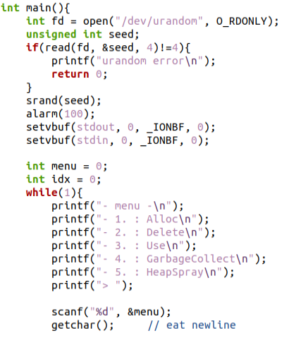
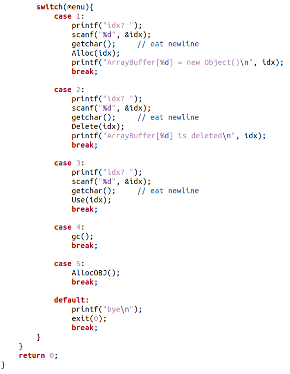
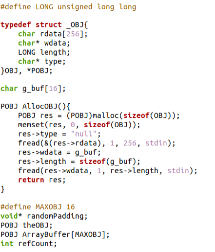
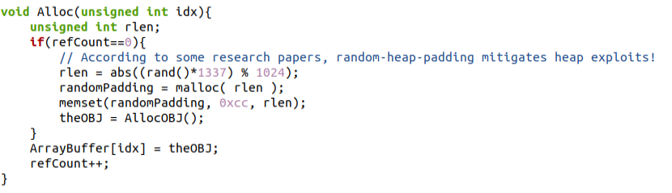
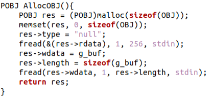
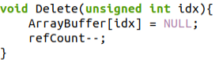
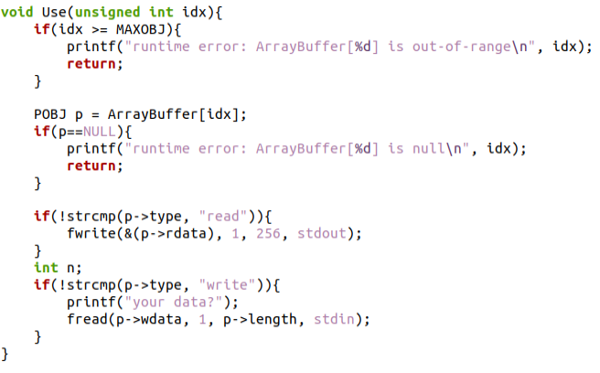
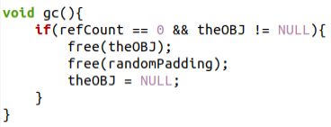
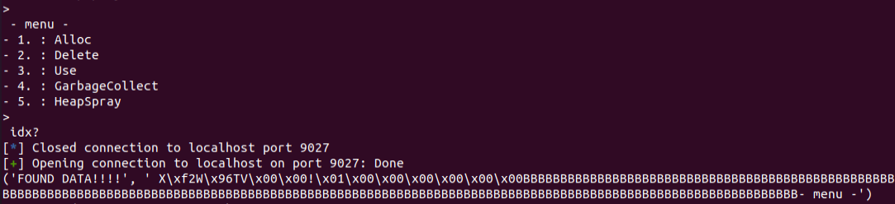
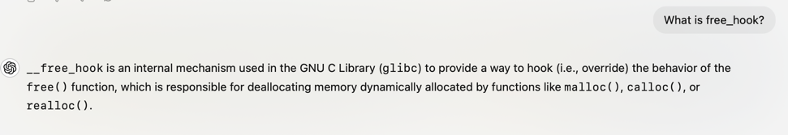

_# Lokihardt
## Analysis

As we can see, the user can access a UI with some memory management operations.
Let's investigate the different operations.

The `Alloc` function starts by checking the `refCount`.
In the first allocation it will be equal to zero, 
which means that padding of randomized length will be allocated on the heap.
Then, an object will be allocated using `AllocOBJ`.
It will be added to `ArrayBuffer` in the requested index and the `refCount` will increase.
An obvious bug is that there is not any validation on the index, which allows us to overflow `ArrayBuffer`.

`AllocObj` allocates an object on the heap.
It sets its type to "null".
It reads 256 bytes from stdin into `rdata`.
It then makes `wdata` to point to `g_buf` which is a 16-byte global array, 
sets the object's length to 16 and reads 16 bytes into `wdata` (hence these bytes are written into `g_buf`).

We will notice that `AllocObj` is also called directly from option 5 "HeapSpray".

`Delete` simply decreases the `refCount` and puts NULL in the appropriate index of `ArrayBuffer`.
We will notice that we can easily delete non-existent objects, allowing us to decrease `refCount` to 0 while an object is still allocated.

`Use` starts by checking that the index is valid in terms of the array size.
Then it checks that the index points to an object that is not NULL.
Then, if the object's type is "read", It writes 256 bytes from `rdata` into stdout.
If the object's type is "write", It reads the object's length amount of bytes into `wdata` from stdin.
What's interesting here is that the user should not have a proper way to set an object's type to something different from "null".

Finally, `gc`, which is short for "garbage collect", starts by checking that the `refCount` is 0 and that `theOBJ` is not NULL,
and if so, it frees `theOBJ` and the allocated padding and sets `theOBJ` to NULL.

## Type Manipulation By UAF
As I previously noted, it seems like we should be able to manipulate an object's type in order to enter the read/write flows of the `Use` option.
Let's try to understand how.
Combining some suspicious points I noted above, I noticed the following interesting flow:
1. Allocate object + padding using the `Alloc` option (index zero).
2. Delete some uninitialized element of the array just in order to reduce `refCount` to 0 (index 15).
3. trigger garbage collect in order to free the allocated object and padding.
4. heap spray a few times to potentially cover the allocated and then freed object on the heap.
5. We still have a pointer to the object in index 0! Activate `Use` to see if the heap spray succeeded.

Overall, this flow activates a UAF vulnerability.
If during the heap-spray we manage to allocate a new object for which the `wdata` pointer overrides the previously freed object's `type` pointer,
then we can enter the read/write scenario of `Use` since we control the new `wdata`.
This is a probabilistic method, but it's my best bet at the moment.

## General Address Leak
I created a script which performs the above flow and managed to activate read in `Use` (saw the new `rdata` printed to stdout).

"BBBB..." is the rdata that is printed to stdout. 
Before this we have 8 bytes of padding between heap chunks and before the padding we have the last part of the previous heap chunk, 
which is a pointer to the type attribute of the previous object.
That is an important address leak which allows us to calculate the base address of the binary, 
because the "null" type is in a constant offset from the base address.
This is interesting because PIE is enabled for the binary.

## LIBC Address leak + Arbitrary Write
So now we have an address leak that allows us to navigate the binary, 
but we still don't know the address into which libc is loaded.
Eventually, we'll want to activate `system("/bin/sh")`, and in order to do so we should know where `system` is, hence where libc is.

In order to do so, and after we've already utilized the basic "read" scenario, let's try to better understand the "write" scenario.
The line that is responsible for the memory writing in this scenario is `fread(p->wdata, 1, p->length, stdin)`.
Therefore, when we perform the heap spray, 
we'll control the address which we write to using `p->wdata` and the length of the payload that we want to write using `p->length`.
We'll also need to make sure that the sprayed struct will have `p->type == write_ptr` in order to activate the "write" scenario properly,
(we have a pointer to "write" in `rodata` section).
If the heap spray was successful, we'll be able to enter our desired payload via stdin.

Now we understand the "write" scenario, but how can we utilize it to leak a libc address?
In order to leak a libc address, the GOT (global offset table) is our friend.
Let's remember that the line responsible for the "read" scenario is `fwrite(&(p->rdata), 1, 256, stdout)`.
If `p->rdata` will be a pointer to the GOT instead of it being an uninteresting payload buffer on the heap, 
then the "read" scenario will leak a libc address for us!
In addition, we need to remember that in order to activate the "read" scenario then we still need to have `p->type == "read"`.
I noticed that "stdout_ptr" in the GOT is in offset 0x201F40, while `g_buf` is in offset 0x202040, exactly 256 bytes difference, how convenient!
Using the "write" scenario, we can make `array_buffer[2]` point to "stdout_ptr", 
and then we will be able to control the wdata and length using `g_buf`, and the type will be pointed by `theOBJ` (directly after `g_buf`).
This way, when using `array_buffer[2]`, we will be able to control whether we are in the read/write flow using an allocate command immediately before the use.
Using the same allocate command we will also control `g_buf` which will give us control over the wdata and length of `array_buffer[2]`.

The above trick gives us two powerful capabilities.
When using it with the read flow, we get a LIBC leak (stdout_ptr).
When using it with the write flow, we can control the write address, so we have an arbitrary write capability.

## Code Execution
How can we trigger a shell using all of the above?
The key question is how do we use the arbitrary write capability.
In the `gc` function, we have `free(theOBJ)`.
We would want to overwrite `free` with system and set `theOBJ` to "/bin/sh", and finally trigger the garbage collection.
Setting `theOBJ` is easy, but what about overwriting `free`?
Full RELRO is enabled for the binary so we cannot overwrite a GOT entry.
What can we overwrite?
I was clueless for a while, but then I decided to scan the writable memory segments of both the binary and LIBC.
I did not really find something that helps me with code execution in the main binary.
However, in LIBC, I stumbled upon `__free_hook` in the BSS segment.
I looked for xrefs in the code and saw that it's an editable pointer in the BSS that allows us to hook the implementation of `free`.

Therefore, what we'll do is to overwrite the `__free_hook` in LIBC to point to `system`.
Then we'll set `theOBJ` to "/bin/sh" and trigger garbage collection, and we'll get a shell.

# Summary
1. Exploit the UAF vulnerability with the read flow to leak an address from the binary and bypass the PIE mitigation.
2. Exploit the UAF vulnerability with the write flow to set an element of `ArrayBuffer` to point to `stdout_ptr`.
3. Step 2 allows us to trigger the read flow and leak a LIBC address.
4. Step 2 allows us to trigger the write flow and achieve arbitrary write, which we'll use to overwrite `__free_hook` with a pointer to `system`, which is a trick performed to bypass the full RELRO mitigation.
5. We will trigger garbage collection, which will trigger `free(theOBJ)` which we manipulated to be `system("/bin/sh")`.