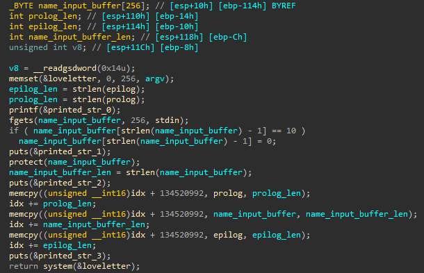
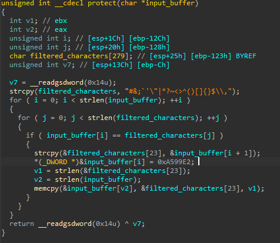
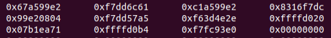

# Love Letter
## Analysis

The program starts by getting the name from the user into an array on the stack, which is limited to 256 bytes.

Then, the `protect` function is called with `name_input_buffer`.
`protect` iterates over the `input_buffer`.
for every character that it finds that matches the set of filtered characters, it does the following:
1. copy the remaining part (after the current character) of the `input_buffer` into the end of the `filtered_characters` array 
(index 23, it's a 22-byte array, and it has enough room to contain both the filtered characters and the 256-byte input buffer).
2. Convert the current character of `input_buffer` to be the heart emoji (for some reason however, only 0xA599E2 and not 0x20A599E2).
3. Copy the remaining part (from stage 1) back to `input_buffer`, after the end of the modified `input_buffer`.

The problem here is that there might be overflow after `input_buffer`, 
as it gets expanded in the conversion of a single character to the emoji.
Since the overflow is on an argument of `protect`, that actually resides in the bottom of the stack frame of `main`, 
we'll be able to use this overflow to overwrite the values of the variables of `main` - `prolog_len` and `epilog_len`.
We cannot overwrite `name_input_buffer_len` because it is set immidiately after `protect`.

After `protect`, the program proceeds to `memcpy` the modified input buffer into `loveletter` so that it will be wrapped by a prolog and an epilogue.
`loveletter` is a 256-byte global array.
After all the `memcpy`, `loveletter` will look like "echo I love (modified input buffer) very much!".
Finally, the system will run `system(loveletter)`, which will `echo` the message.

Using the stack overflow in `protect`, we'll be able to provide the `input_buffer` as `"/bin/sh...(overflow payload)"`,
so that the overflow payload will reset `prolog_len` and `epilog_len` and will make `name_input_buffer_len` to be equal
to `len("/bin/sh") == 7`.
This way, the final command in main, `system(loveletter)` will run `system("/bin/sh")`.
Not sure if it will actually work, but that's the direction.

## Overflow Structure
I wanted to understand better how the overflow and the `protect` function work, so I debugged the binary.
I gave an input of "#gal" and looked at the stack in `main`.
This input crated a modified input buffer with length 44:

As we can see, the buffer now starts with the emoji - 0xa599e2.
Then, 0x67, 0x61, 0x6c is "gal".
But why does the string continue for more than that?
This made me realize another problem.
`main` makes sure to reset the last byte of `name_input_buffer` (after the `fgets`).
However, in `protect`, this byte will be overwritten (in any case that the filtered character is not the last character in the input buffer), 
and then the modified `name_input_buffer` will be affected from irrelevant values that resided on the stack previously.

I wanted to edit the value of `prolog_len` so I continued to try another values.
I tried `"A" * 253 + "#"` and it zeroed `prolog_len`.
Now, I'll want the payload to start with some bash command that will activate a shell.
We cannot use "/bin/sh" because the spam in the end of the payload will ruin it.
I realized that I can just print the flag instead of granting a full shell.
I used the payload `"cat flag ".ljust(253, "A") + "#"` and got the flag.

## Summary
The payload `"cat flag ".ljust(253, "A") + "#"` works.
It zeroes `prolog_len`, hence eventually, `system("cat flag AAAAA...")` will run, 
which will print the flag alongside some other spam.
