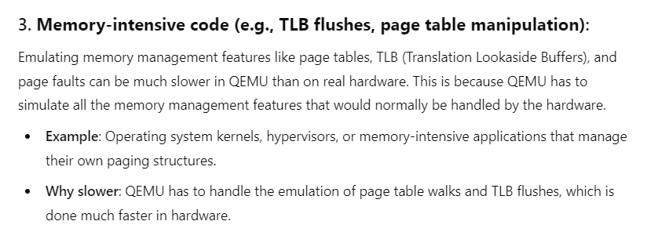

# Malware
## Analysis
We are given the Python code of a server.
This is the message we receive upon connection:


So we should input two functions, A and B.
Each function's x64 ASM input is restricted to be maximum 40 characters and to not contain blacklist ASM instructions:

```python
black_list  = ['jne', 'je', 'jmp', 'ret', 'and', 'mov', 'push', 'pop', 'xor', 'loop', 'sh']
black_list += ['"', '/', '#', '(', ')', '*', '&', '\'', '\n', '\t', '\x00', '@', '^', '+']
black_list += ['sub', 'add', 'jz', 'jnz', 'byte', 'int', '80', 'leave', 'syscall', 'xchg', 'nop']

def check( code ):
	for e in black_list:
		if code.lower().find(e) != -1: return False
	if len(code) > 40: return False
```

Then, A and B are compiled into a C code that compares the execution times of the functions,
and determines whether the code runs from an emulator or from a real CPU.
It runs each function 10000 times and calculates the overall running time per function (t_A and t_B).
The final decision is made accordingly:
1. if t_A is bigger than t_B by more than 20% - emulator.
2. if t_B is bigger than t_A by more than 20% - real CPU.
3. Otherwise - cannot determine.

```
#include <stdio.h>
#include <stdlib.h>
#include <sys/mman.h>
#include <seccomp.h>
#include <sys/prctl.h>

void sandbox(){{
	scmp_filter_ctx ctx = seccomp_init(SCMP_ACT_ALLOW);
	if (ctx == NULL) {{
		printf("seccomp error\\n");
		exit(0);
	}}

	seccomp_rule_add(ctx, SCMP_ACT_KILL, SCMP_SYS(connect), 0);
	seccomp_rule_add(ctx, SCMP_ACT_KILL, SCMP_SYS(dup), 0);
	seccomp_rule_add(ctx, SCMP_ACT_KILL, SCMP_SYS(dup2), 0);
	seccomp_rule_add(ctx, SCMP_ACT_KILL, SCMP_SYS(dup3), 0);
	seccomp_rule_add(ctx, SCMP_ACT_KILL, SCMP_SYS(open), 0);
	seccomp_rule_add(ctx, SCMP_ACT_KILL, SCMP_SYS(openat), 0);
	seccomp_rule_add(ctx, SCMP_ACT_KILL, SCMP_SYS(execve), 0);

	if (seccomp_load(ctx) < 0) {{
		seccomp_release(ctx);
		printf("seccomp error\\n");
		exit(0);
	}}
	seccomp_release(ctx);
}}

unsigned long long rdtsc(){{
	unsigned long lo, hi;
        asm( "rdtsc" : "=a" (lo), "=d" (hi) ); 
        return( lo | (hi << 32) );
}}

void A(){{
	asm("{0}");
}}

void B(){{
	asm("{1}");
}}

unsigned long long measure_time(void (*f)(), int cnt){{
	register int i = cnt;
	unsigned long long t2, t1;
	t1 = rdtsc();
	prctl(PR_SET_TSC, PR_TSC_SIGSEGV);
	while(i--) f();
	prctl(PR_SET_TSC, PR_TSC_ENABLE);
	t2 = rdtsc();
	return t2-t1;
}}

int main(int argc, char* argv[]){{

	unsigned long long t_A=0, t_B=0;
	void* p = mmap((void*)0x66666000, 0x1000, PROT_WRITE|PROT_READ|PROT_EXEC, MAP_ANONYMOUS|MAP_SHARED, -1, 0);

	sandbox();	

	measure_time(A, 10);		// warm up cache
	t_A = measure_time(A, 10000);

	measure_time(B, 10);		// warm up cache
	t_B = measure_time(B, 10000);

	if( t_A > t_B*1.2 ){{
		printf("emulator! (A:%llu, B:%llu)\\n", t_A, t_B);
	}}
	else if( t_B > t_A*1.2 ){{
		printf("realcpu! (A:%llu, B:%llu)\\n", t_A, t_B);
	}}
	else{{
		printf("im not sure... (A:%llu, B:%llu)\\n", t_A, t_B);
	}}

	return 0;
}}
```

The server runs 100 iterations of the binary, each time either from an emulator or from a real CPU, chosen randomly.
If the binary detects its running context successfully in at least 98/100 times, we get the flag.

To sum up, we should provide functions A and B that pass the input criteria, 
so that A will noticeably slower than B on an emulator, while A is noticeably faster than B on a real CPU.

## Solution
I started by asking ChatGPT "what code will run slower on a QEMU emulator than on a real CPU".
One of the options it gave me was "memory-intensive code".



After taking another look at the code, I remembered that the binary uses `mmap` to map executable memory,
while it does nothing at all with this mapped memory.
This might be an interesting hint.
So if we'll run code that messes with this memory, maybe we'll be able to achieve the desired result.

I wanted to check my hypothesis using the following ASM code:

```
mov rdi, 0x66666000
mov al, 0xab
mov [rdi], al
```

But we have a problem because it does not pass the blacklist.
In order to pass the blacklist, we can use the `.octa` macro, 
which allows us to enter the byte-code in 16 bytes chunks, instead of the assembly code.
When using the full 16-byte capacity of octa, we use exactly 40 bytes, 
so we can craft any assembly code using this method up to 16 bytes of byte-code.

The original code I wanted to craft is 11 bytes, so we're good.
I padded it with 5 NOPs and received the following input: 

`.octa 0x0788abb066666000c7c7489090909090`

I received that the emulation slows this code in magnitudes between 15 and 30.

I wanted to benchmark whether it's good by using NOPs.

I started by trying `.octa 0x90909090909090909090909090909090` but the result did not satisfy me.
I thought that maybe repeating NOPs in a loop for more than 16 times may give more accurate results with less variation.
I tried with more NOPs: `.rept 0x500; .long 0x90909090; .endr`.
Now I received a much more similar running time either on simulation or on real CPU!

The problem I have now is that my A code is much slower than my B code even on less than 0x500 repetitions,
so I need to find a way to make A slow enough while keeping the proportion of slowness between real CPU and emulation.
It would be hard to use the `.rept` macro because the `.octa` is already the maximum input size.
However, I noticed that I can remove the `mov al` opcode and that I can replace `mov [rdi], al` with `stosb`,
which is like `mov [rdi], al; inc rdi`.

Now I could perform up to 0x1000 repetitions (mapped buffer size) of A in the following way:

`.rept 600;.quad 0xaa66666000c7c748;.endr`

After some trial and error, I used 600 repetitions for A and 0x700 repetitions for B and succeeded.
So the final A and B are:
* A: `.rept 600;.quad 0xaa66666000c7c748;.endr`
* B: `.rept 0x700; .long 0x90909090; .endr`
