# Maze
## Analysis
By trying to play the game, we can see that the program is a maze game.

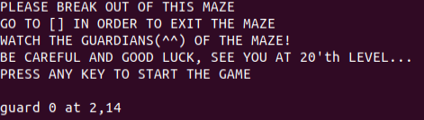

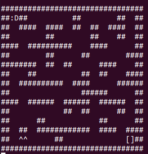

We should navigate our player using "wasd" keys to the end of the maze, while avoiding the guards.
I played a few games and noticed that in every stage the number of guards is incremented.

We are given an example `maze_map.txt` file.
The maze map is represented in a txt format.
1 is a wall, 0 is empty space, S is the player, E is the end of the maze, and G is a guard.

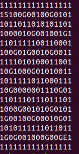

I continued with some reverse engineering.

I started by looking at the main function.

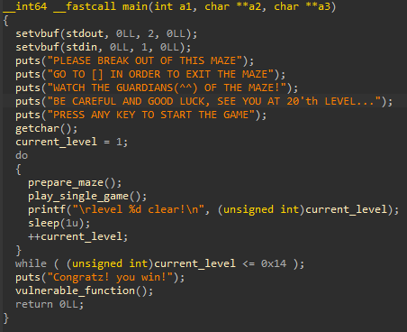

It looks that after 20 wins of the maze, a function with a very obvious buffer overflow is called.

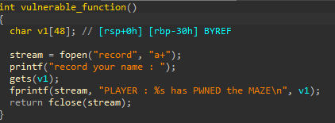

In addition, I found in the binary a function that calls `system("/bin/sh")`, for our convenience.

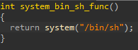

Let's try to understand what happens at every level of the maze.

`prepare_maze` loads the maze from a txt file into a 16x16 array in memory.
It parses the map to initialize the location of the player.
In addition, the guards locations are saved in two arrays (one for the columns and one for the rows).
For level X, the maze will have X guards.
The guards are chosen in a prioritized manner, so that the guards in the lowest rows are chosen first.

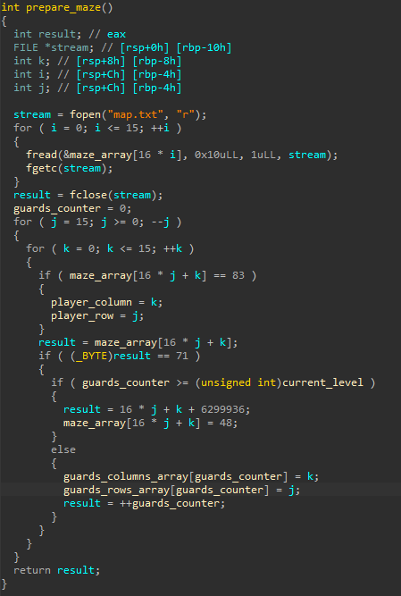

`play_single_game` is responsible for the flow of a single game.

Every iteration of the game starts by moving the guards.
This is the reason why the guards locations are not necessarily identical in each level - 
the initial position is identical but the guards are moved before the player moves.
After moving the guards, the maze is printed, and it's validated that the player isn't caught (in such case the program exits).
Finally, the player should choose its move.
As long as the player's move conflicts with the borders of the maze, `is_move_valid` returns that the move is invalid, 
and the above continues in a loop (from the moving of the guards to here).
Otherwise, the player's move is performed.

Game iteration:

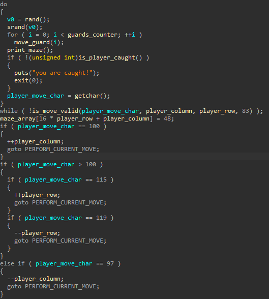

Perform current move label:

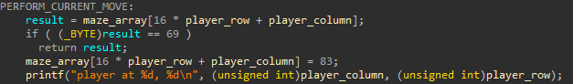

Makes sense so far.
However, there is kind of a secret mode.

Let's look at `is_move_valid`.

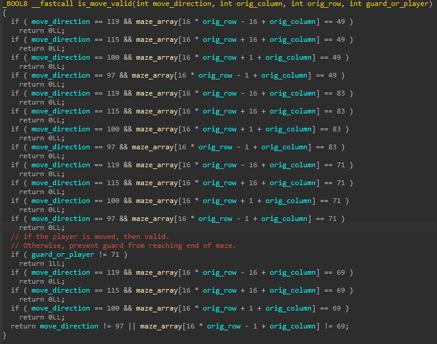

We can see that a player's move that is not "wasd" is allowed.

And indeed, here is the handling of the secret mode.

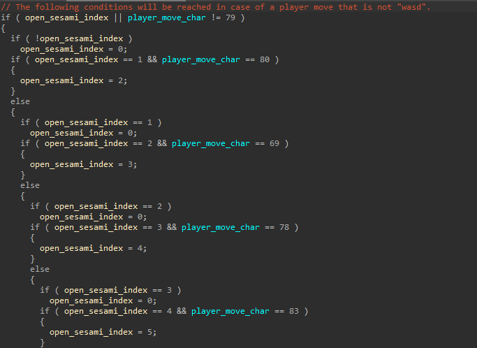

And so on, until:

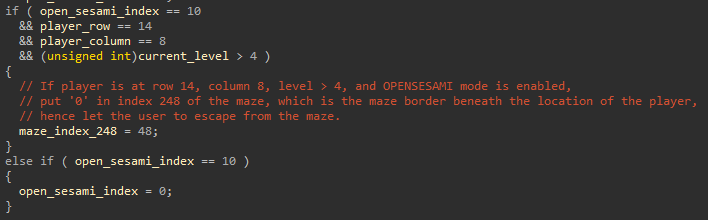

So overall. the secret mode is as following:
The user should enter "OPENSESAMI".
Then, when the user is located at row 14, column 8, on levels > 4, 
it can enter some random character and escape from the borders of the maze.
This is interesting, and can lead to plenty of undefined behavior.

I played the maze until I reached level 5 and triggered the OPENSESAMI mode successfully:

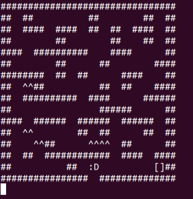

Now I would want to traverse the memory until I will reach the current level global variable.
The line that updates the location of the player on the maze (in `PERFORM_CURRENT_MOVE`)
will overwrite the current level to be 83.
The traversal is convenient as the `current_level` global variable is in the BSS, close to the maze array.
Index 248 of the maze is in address 0x602218 and the current level is in 0x602244.
I can use 2 "down" (s) operations and then another 12 "right" (d) operations for the traversal.
I did so, and then returned back to the maze, 
waited for my opportunity for when the guards are away from the end of the maze, and reached the end myself.

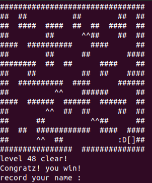

Now we are in the vulnerable function.
Our payload should be "A" * 56 + address of function that calls `system("/bin/sh")`.

The problem is that the address of the shell function contains non-ascii characters, which I couldn't manage to print to the shell manually.
I thought about automating a pwntools script for this challenge even though it might seem hard because of the maze solving.
I remembered that the moves of the guards are not randomized properly, so every new game should be identical to the previous games.
Therefore, our script should not solve the maze on its own, we can just record previously successful games and our script will use them.

Levels 1 to 4 can be solved using the following sequence: "ssdssddssddddwddssddsddsssassd".

Level 5 can be solved this way: "ssdssddssddddwddssddsddsssassOPENSESAMIadaaaaaMsssddddddddddddaaaaaaaaaaaawdadadawwdddddd"

Afterwards the script exploits the BOF with pointer to the `system("/bin/sh")` call 
that overrides the return pointer of the vulnerable function, and the shell is opened successfully :)

