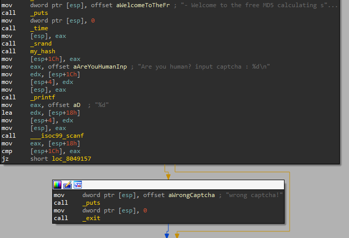
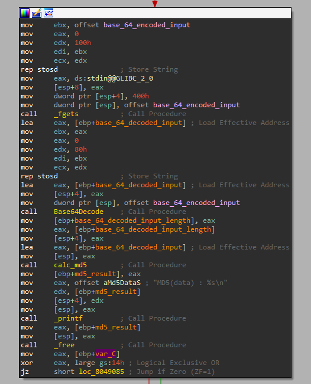
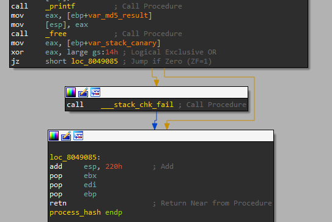
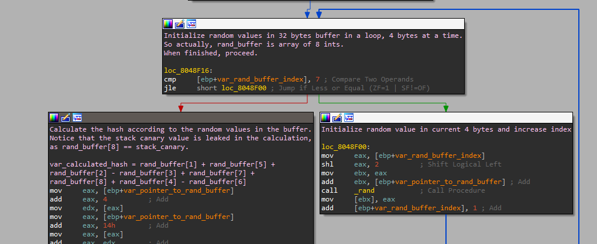
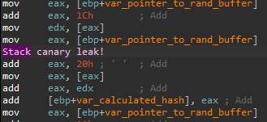
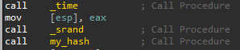

# MD5 Calculator

## Introduction
We are given an MD5 calculator as a network service.
We should find a bug and exploit it to get a shell.

## Static Analysis
The program starts with a welcome message, followed by a randomly calculated captcha,
using `srand` and `my_hash`.
The user should enter the printed captcha in order to proceed with the program,
otherwise the program exits with "wrong captcha" message.

After entering the correct captcha, the program proceeds to the function `process_hash`.
The user is asked to enter its input in a base64 encoded format, then the program decodes the input,
calculates the MD5 hash and prints the result to the user.

Then the function `Base64Decode` is called, with pointers to `base_64_encoded_input` and `base_64_decoded_input`.
The function returns the decoded result in `base_64_decoded_input` and returns the length of the decoded result.

Afterwards, `calc_md5` is called, with `base_64_decoded_input` and `base_64_decoded_input_length` as its arguments,
and returns the calculated `md5_result` using a pointer which was allocated in the function.

The program prints the calculated MD5 result, frees the allocated pointer and exits.

## Vulnerability
Let's focus on the previously attached snippet from `process_hash`, as everything before and after there looks safe.
The call to `fgets` is safe, as `base_64_encoded_input` is indeed of length 0x400==1024.

The call to `Base64Decode` looks very interesting, as `base_64_encoded_input` is of length 0x400==1024, 
but `base_64_decoded_input` is allocated on the stack with only 0x200==512.
decoding 1024 bytes of encoded base64 leads to 768 bytes, which means that we potentially have a significant stack overflow vulnerability here.
Indeed, when entering `"a"*1024` as my encoded input, the "thank you for using our service" message is not printed, 
presumably because we had a stack overflow.
However, stack protection is enabled for the binary (as demonstrated below), so we should find a way to address this in our exploitation.

If we assume that we can handle the stack canary, the exploitation becomes pretty simple, 
as we can overwrite the return pointer of `Base64Decode` to `_system` (in PLT section), 
write `"/bin/sh"` on the BSS in a constant address (the encoded input is on the BSS) 
and then call system with the pointer to "/bin/sh".

## Stack Canary
So we found a significant stack overflow vulnerability, but we made a big assumption that we can handle the stack canary.
Let's try to find if the stack canary can be leaked somewhere in the program.

I saw that the stack canary is also in use in `my_hash` function, that is used for generating the captcha.
The captcha calculation is based on a simple arithmetic operation on 8 random integers.

I noticed that the stack canary is leaked in the captcha calculation, 
as the access to the random integers buffer overflows to the stack canary,
which comes immediately after the mentioned buffer on the stack.

But the value of the stack canary is leaked with another 7 random integers, so how can we deduce its value?
`srand`, which functions as a seed for randomization, is called just before the call to `my_hash`.
The supplied seed is the return value of `time` function, which returns the time since the epoch timestamp in seconds.

I noticed that my local time and the pwnable server time are synced, 
which means that I can create a local C program that will calculate the random values calculated in `my_hash`,
and then deduce the stack canary value based on the received captcha and the calculated random values.
This solution will not work 100% of the time because of timing issues, but it's good enough for us.

## Exploit Summary
1. Calculate the random values of `my_hash` using a local C program.
2. Read and send the captcha, and deduce the value of the stack canary based on the captcha and calculated random values (1).
3. construct the payload in the following way: 512 dummy bytes ("A") + stack canary + 12 dummy bytes ("A", 8 dummy bytes after canary + fake old ebp) + `system` pointer + 4 dummy bytes ("A", fake return address) + "/bin/sh\n" pointer (explained in 6).
4. Add padding as necessary so that the encoded payload will not end with "=" (since we'll concatenate additional, already base64 encoded payload afterwards).
5. Encode the payload in base64 format.
6. Add "/bin/sh" to the end of the encoded payload, as "/bin/sh" is already a properly encoded base64 string (add base64 padding before "/bin/sh" if needed because we want the null terminator to come immediately after "/bin/sh").
7. Send the complete payload.
8. Profit.
