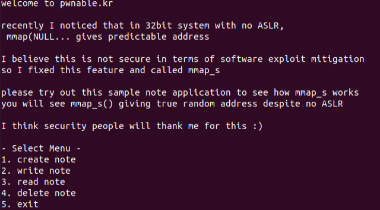
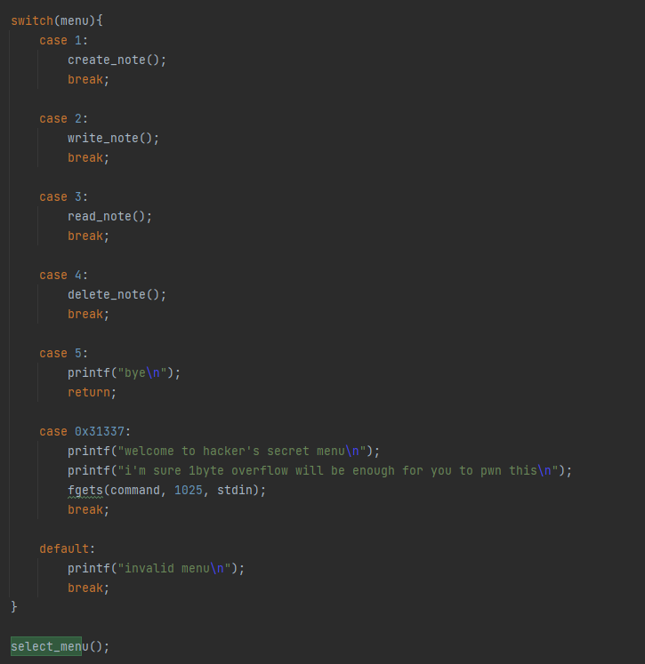
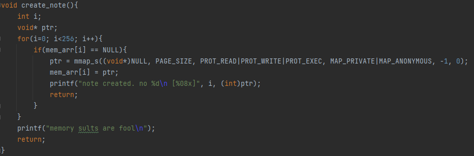
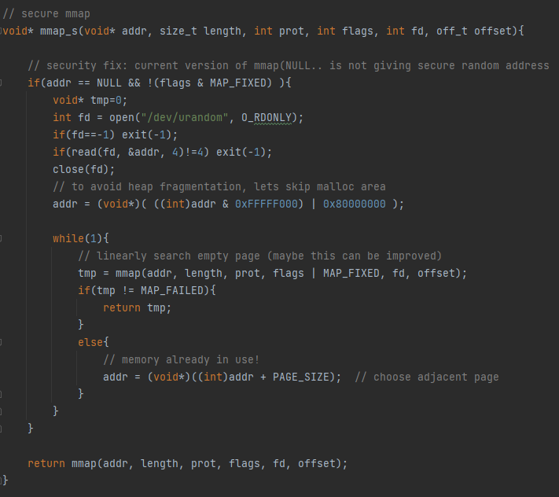
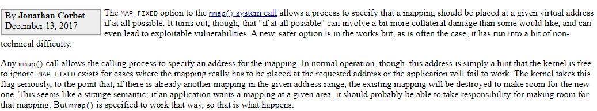
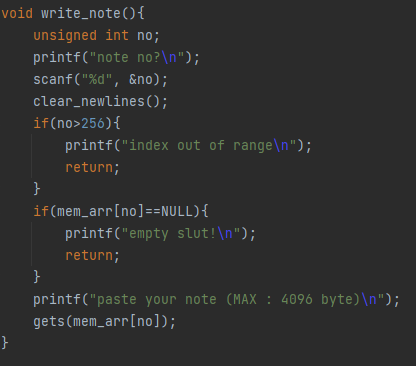
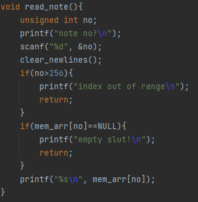
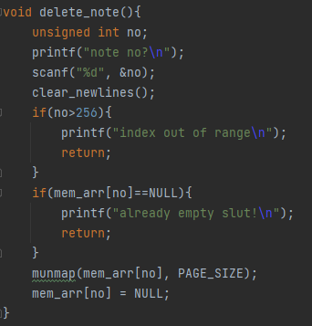
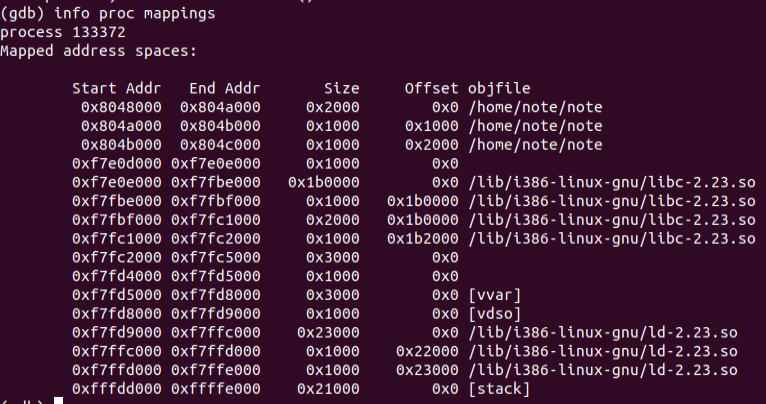

# Note
## Analysis

We are greeted with a welcome message and a menu which we should choose from.

The `select_menu` function lets us choose between the options.
It is called in a loop using recursion.
There is also a "secret" menu which gives us a 1 byte overflow on the stack, not sure how it's useful.

`create_note` allocates a 4096 byte memory area on request using `mmap_s`.

`mmap_s` tries to implement a secure memory map by randomizing the mapped addresses.
It randomizes an address, aligns it to a page (4096 alignment) and then searches for an address by calling `mmap` until the return value is not `MAP_FAILED`.

Regarding the use of `MAP_FIXED`, it looks like there is a bug, since new memory mappings will simply overwrite existing mappings.

Let's proceed.

`write_note` asks the user for the note number, checks that it is indeed mapped and then lets the user write into the memory area.
There is no validation on the user input.

`read_note` does not really look vulnerable.

`delete_note` does not look too interesting as well.

## Exploitation
The important insight from the analysis is that mappings will be created in existing interesting memory areas.
The possible areas are the stack, libs.so and ld.so (the code itself won't be mapped because of validations performed in `mmap_s`).

This means that if we create a note that lands on an interesting sequential mapped memory area, we can write to this area how many bytes that we like.

The whole stack is writable, and stack contains return pointers which will help us control the flow of the program.
We would like to overwrite some return pointer, the problem is that we do not know the addresses of the return pointers.
Actually, after looking at the code again, I see that it's mentioned explicitly that ASLR is disabled for the binary.
It means that the stack will always be mapped to the same address, and that we can accurately predict its behavior.

How does the stack of the binary behave?
The key detail here is the recursive implementation of `select_menu`.
Instead of calling it in some sort of while loop, the program uses recursion in order to continue its operation.
How does it affect the stack?
After each menu choice, the stack expands upwards by 0x430 bytes.
This is true for every choice except for the "exit" choice, which causes the recursion to fold.
When the recursion folds, if we spray a note that was part of the stack (at any point of the stack's life) with a return address,
we will redirect the execution to this address.

Therefore, we will start by placing our `execve("/bin/sh")` shellcode in the first note that is created.
Afterward, we will create a note and delete it until the created note lands on the stack.
We will maintain the stack address after each create/delete operation, 
because the fact that the stack expands increases our chances that the created note will land on the stack.
After some tries, we will get lucky and create a note that is on the stack.
Then we will spray this note with the shellcode address (that is already placed in the first note).
Finally, we will trigger the exit option which will fold the recursion and will redirect the execution to the shellcode.
