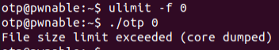
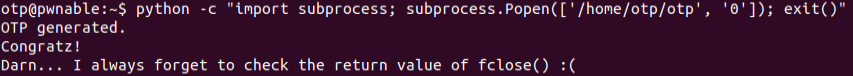

# OTP
## Introduction
We are given a skeleton interface for one time password authentication system.
We should find a bug and exploit it to get the flag.

## Static Analysis
The program runs with a passcode CMD argument, which is supplied as a CMD argument.
The program then opens "/dev/urandom", attempts to read 16 bytes from it into `otp[0], otp[1]` (each one is long long, so 8 bytes each), 
and exits in case of failure.
The program then opens a new file, with its name being the value in `otp[0]`, and writes the value of `otp[1]` to the file.
The program then reads the recently written value into a passcode variable on the stack, compares it to the supplied passcode argument `argv[1]`,
and grants a shell in case of success.
Finally, the `otp` file that was previously created is unlinked.

## Vulnerability
On first sight, the program does not look very vulnerable. There isn't any type of buffer overflow or other vulnerabilities we have seen so far.
However, I noticed one bad practice in the code.
When read/write/close operations were performed on the OTP file, no validation was performed on the return values of these functions.
This functions should not really fail in a regular flow of the program, but what if we could force them to fail?

## Exploitation
After some more research, I found out about the command `ulimit`.
This command, generally, allows limiting system resource amounts.
In particular, performing `ulimit -f 0` allows limiting the maximum size of files written by the shell.
Therefore, performing this before running the OTP executable will cause the writing to the OTP file to fail,
and then reading from the file will fail as well, and the passcode will be zero, its initial value.
This should work by theory, the problem is that a signal that terminates the program is sent before printing the flag.

This can be solved by running the above from a sub-process:

## Exploitation Summary
1. `> ulimit -f 0`
2. `> python -c "import subprocess; subprocess.Popen(['/home/otp/otp', '0']); exit()"`
3. Profit.
