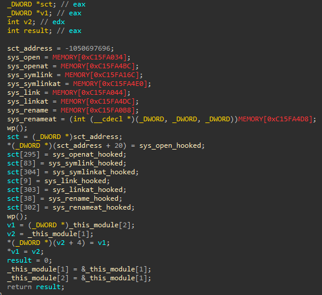
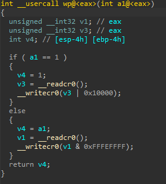
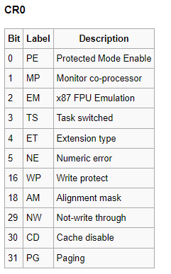
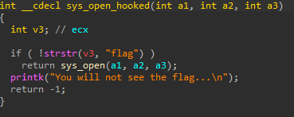
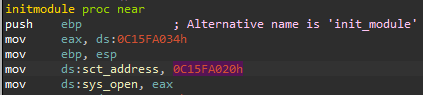

# Rootkit
## Analysis
Let's analyze the `rootkit` kernel module.

Let's start with `initmodule`.

It starts by assigning pointers to some syscalls into global variables.
Then, the `wp` function is called.

`wp` modifies the register `cr0`.

So according to this table, what `wp` does it to enable write protection if protected mode is enabled, 
or disable it if protected mode is disabled.
I'm not sure if it's interesting, moving on for now.

Let's go back to `initmodule`.
Now it updates a few syscalls in the syscall table to be `syscall_hooked` instead of the original syscall.

Let's look at `sys_open_hooked` for example.
All the other hooked syscalls follow the same pattern.

What the hook does is to check whether "flag" was transferred as argument to the hooked function (using `strstr`).
If so, it blocks the syscall, otherwise it calls it with the supplied arguments.
For example, when I try to create a file with the name `test_flag`, I get the message "You will not see the flag".

Finally, there are some weird operations with `_this_module`, which I'm not sure what is the purpose of them.
When I looked at `_this_module`, I saw the string `rootkit`.

## Kernel Module Patching
I looked at the code and I realized there is nothing special about it.
No vulnerability or anything interesting.
Then I realized that I'm the root user, oops.
So no vulnerability here.
I tried `rmmod` and it didn't work because the module does not restore the changes it does in the syscall table on cleanup.
But we can patch the kernel module to our liking to bypass its protections, 
and then load it as a new kernel module.

The first obvious thing that we would want to change is every occurrence of the "flag" string in the kernel module binary.
We will run in the command line `sed -i 's/flag/poop/g' rootkit.ko`.

I tried to `insmod rootkit.ko` and received "module is already loaded".
Changing the name of the file did not work.
Then I remembered about the `_this_module` struct, and remembered that it contained the string "rootkit".
I decided to modify the occurrences of this string:
`sed -i 's/rootkit/abcdefg/g' rootkit.ko`.
Now, I managed to reload the kernel module.

The sad news is that even after my changes, I get the exact same "You will not see the flag".
Why does this happen?
I realized that in the first loading of the kernel module, the hook wrap the existing syscalls.
When I'm reloading the module, the existing syscalls are already hooked.
So I need to find a way to restore the syscalls back to the original so that the hook will wrap the original syscall.
I realized that the interesting hook is probably the hook for `sys_open` since I'm using `cat flag`.
In order to perform this patch, let's review again `initmodule` (this time without the decompiler).

What we'll want to patch is that instead of `mov eax, ds:0c15FA034h`, which is a pointer from the existing syscall table 
(see the value of `sct_address` immediately afterwards), will have a pointer to the actual `sys_open`.
In order to get this actual address, we'll take it from `/proc/kallsyms` - 0xC1158D70.
The patched assembly - `mov eax, 0xC1158D70`.
We'll run `sed -i 's/\xa1\x34\xa0\x5f\xc1/\xb8\x70\x8d\x15\xc1/g' rootkit.ko`.
For some weird reason, the '\x' escaping did not work for me on the target machine, 
so I did the patches locally and then transferred back to the target machine (using base64), and then `cat flag` worked.

For some weird reason the flag was compressed, so I transferred it back home again, uncompressed the gzip and received the real flag.

## Summary
1. Copy the kernel module binary to some local Linux machine (I used base64 to do this).
2. Patch "flag" occurrences in the binary to allow `cat flag` - `sed -i 's/flag/poop/g' rootkit.ko`.
3. Patch "rootkit" occurrences in the binary to allow reloading the module - `sed -i 's/rootkit/abcdefg/g' rootkit.ko`.
4. Patch the binary so that the hook will wrap the original `sys_open` and not the existing entry in the syscall table - `sed -i 's/\xa1\x34\xa0\x5f\xc1/\xb8\x70\x8d\x15\xc1/g' rootkit.ko`.
5. Transfer the patched binary back to the target machine.
6. insmod `rootkit.ko`.
7. `cat flag`.
8. Uncompress the received gzip.
9. Profit.
