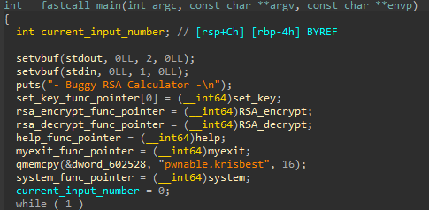
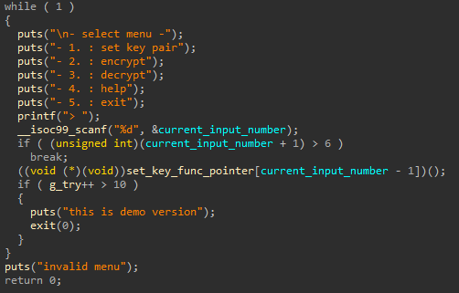
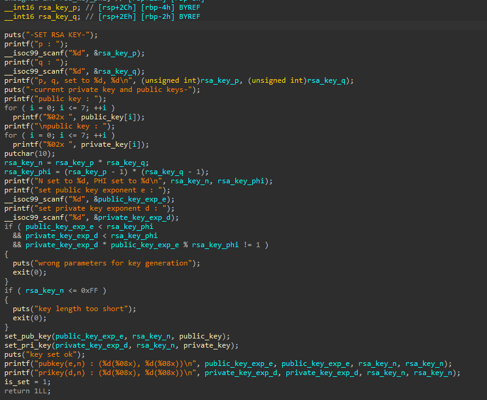
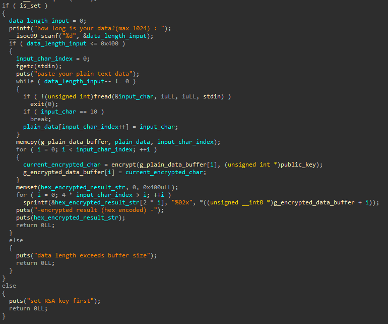
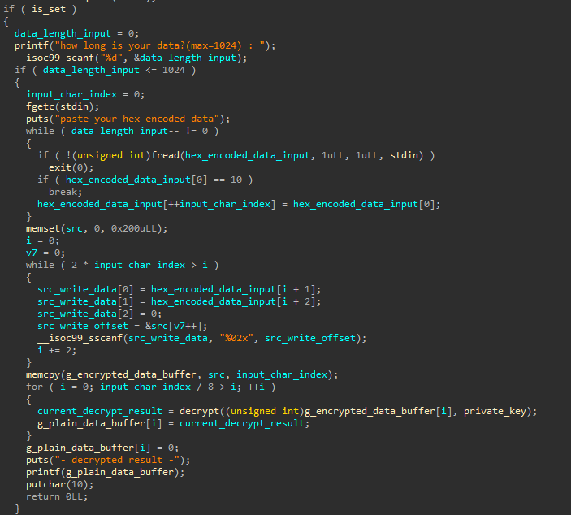

# RSA Calculator
## Analysis

The `main` function starts by assigning function pointers to the relevant handling functions.
We'll notice the weird "pwnable.krisbest" and `system` pointers, which might be useful afterwards.

Then, the main loop asks for the user to choose the desired function.
The input is validated so that the choice is indeed between 1 and 5.
If an invalid choice is entered the program exits.
In addition, a global `g_try` is incremented after each valid choice and limits the user for only 10 choices.
We can already see the first vulnerability here: -1 or 0 can be entered as a valid choice, triggering an undefined function pointer.

Let's investigate the actual functions now.
The `help` and `myexit` functions don't look interesting.

In order to use encrypt or decrypt, the `set_key` function must be used, so let's investigate it.
Seems like it receives some input (with validations) and sets parameters in the context of RSA, but I did not find anything that looks vulnerable.

Now I looked at `RSA_encrypt`.
The first interesting thing that came to mind is that it seems like there is an overflow into `g_encrypted_data_buffer`,
as it is a 256 int array, but in the loop (after `memcpy`) it receives values up to the 1024 offset.
This is a massive overflow that gives us full control over the function pointers mentioned above.
In addition, `hex_encrypted_result_str` will overflow on the stack.

`RSA_decrypt` looked interesting as well.

You can notice that before performing `memcpy` from `src` on the stack to the global `g_encrypted_data_buffer`,
`src` is set according to the `hex_encoded_data_input`.
In this loop, 1024 bytes are copied into `src`, while it is only 520 bytes.
This potentially allows us an overflow on the stack, but we have a stack canary.
However, immediately afterward, we have a format string vulnerability.
We'll notice that the format string vulnerability is activated on the decrypted data, 
so we'll need to encrypt our data before sending the FSB payload.
In addition, we can control this decrypted data, so our payload can look like "encrypted FSB payload that writes to memory + pointer to memory".
This way, we can write whatever value we want to whatever memory address.
This looks like the easiest vulnerability to exploit here.
Using the FSB, as described above, we can edit a function pointer, for example the `myexit` function pointer, 
and make it point to `g_plain_data_buffer`, into which we'll put our shellcode.

## Exploitation Summary
1. Set RSA key.
2. Encrypt the FSB payload.
3. Trigger the FSB in `RSA_decrypt` using the encrypted payload + pointer to `myexit`, and overwrite this pointer to point to `g_plain_data_buffer`.
4. Place the shellcode in `g_plain_data_buffer` by sending it to `RSA_encrypt`.
5. Trigger `myexit`.
6. Profit.