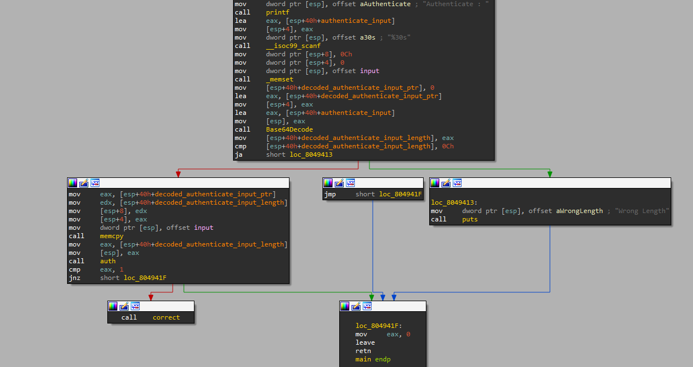
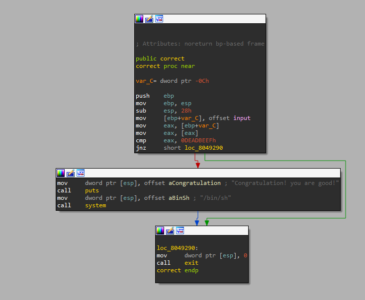
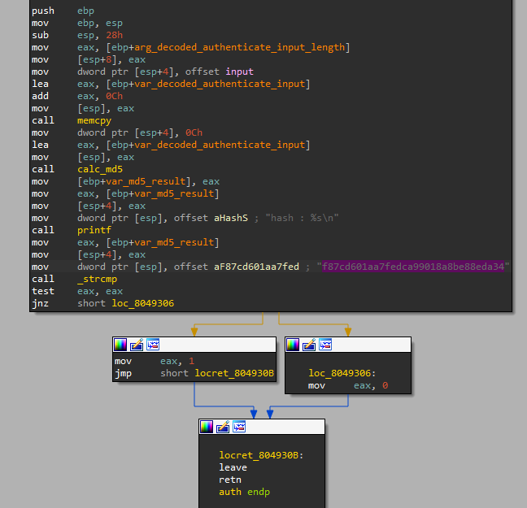
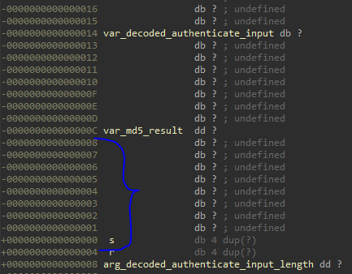

# Simple Login
## Introduction
We are given an authentication service.
We should somehow get the flag through the service.

## Static Analysis

The program starts by asking the user to authenticate.
The user should enter a base64 encoded string as its authentication.
If the length of the decoded input is greater than 12, the program exits.
Otherwise, it performs `memcpy` on the decoded authentication into `input`, which is a variable in BSS,
and continues to `auth`.
If `auth` succeeds (returns 1), ths program is continued to the `correct` function.

The `correct` function grants the user a shell if the first 4 bytes of `input` are equal to `0xDEADBEEF`.

The `auth` function starts by performing a `memcpy` from `input` to a variable on the stack.
Then, the md5 hash is calculated based on the variable on the stack, and printed to the user.
If the calculated hash is equal to a previously calculated hash, then the `auth` function returns success.

## Vulnerability
The vulnerability lies in the call to `memcpy` in `auth`, pictured above.
`memcpy` copies the decoded input from the BSS, which is of size at most 12, into the stack as demonstrated below:

There are two problems here:
One, the authentication input on the stack is allocated only 8 bytes, while the maximum size is 12 bytes.
Two, The `memcpy` isn't even performed to the correct address on the stack, which allows us to overflow into the return frame pointer of `auth`.
This confirms the behavior of the authentication service, as I get different hash calculations for the same input on consecutive runs,
which is a result of the fact that the decoded authentication input on the stack of `auth` is not initialized properly.

## `auth` Return Frame Pointer Overflow
So we have control over the return frame pointer of `auth`, let's figure out how this affects us.
The exit block of `auth` performs the two following assembly instructions: `leave` and `retn`.
`leave` restores the stack, and does the following: `mov esp, ebp; pop ebp`.
Then, `retn` restores the instruction pointer, according to the recently updated stack pointer, a.k.a `esp`.
By overwriting the return frame pointer of `auth`, we can change `ebp` at the end of `auth`, but we'll still return to `main`.
The authentication will fail, `correct` will not be called and `main` will finish.
However, when `main` finishes, it does `leave` and `retn` as well.
`leave` will update the stack pointer according to an address we determined in the stack overflow in `auth`,
and then pop two values from the stack, and update the frame pointer and the instruction pointer accordingly.
So we cannot control the instruction pointer at the end of `auth`, but we can control the instruction pointer at the end of `main`.
We want to return from `main` to `correct`, and we want `input` (on BSS) to begin with `0xDEADBEEF` so that `correct` will grant us a shell.

## Exploitation summary
1. Set the first 4 bytes of the payload to `0xDEADBEEF`.
2. Set the next 4 bytes to be the address of `correct`.
3. Set the next 4 bytes to be the address of `input`.
4. Encode the payload in base64 format and send the encoded payload.
5. Profit.
