# Starcraft
## Analysis
The starcraft binary looks like some sort of RPG game.
I started by trying to play the game, while reversing the binary in order to understand how it works.
Reversing this binary was relatively complicated in comparison to previous binaries, 
as the code-base itself is relatively large and consists of OOP C++ code.

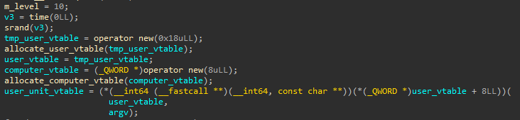

In the beginning of main, two vtables (class instances) are allocated - one for the user and one for the computer.
There is nothing too interesting I found in the allocations of the user and the computer.

In addition, a unit instance is allocated for the user.
Let's investigate what it means.

But first of all, let's explain the general units and inheritance structure of units in the game.
Essentially, a unit is the abstract class that represents a general character in the game.

You have maybe the simplest units that are called Terran units.
These units are Marine, Firebat and Ghost.
They have HP, weapon and armor.

Then, you have Protoss units.
These units are Zealot and Dragon.
They are like the terran units, but they also have a shield.
Any damage applied to protoss units will first impact the shield, 
and only after the shield is destroyed the unit's HP will be affected.

You have Zerg units.
These units are, Zergling, Hydralisk and Ultralisk.
They have the option to burrow their opponent.
It looks like this option simply stalls the fight, until it's turned off and the fight continues.

Finally, you have the Templar unit, which have plenty of attack options, 
between them the option to spawn a Protoss unit called Arcon that will fight for them.

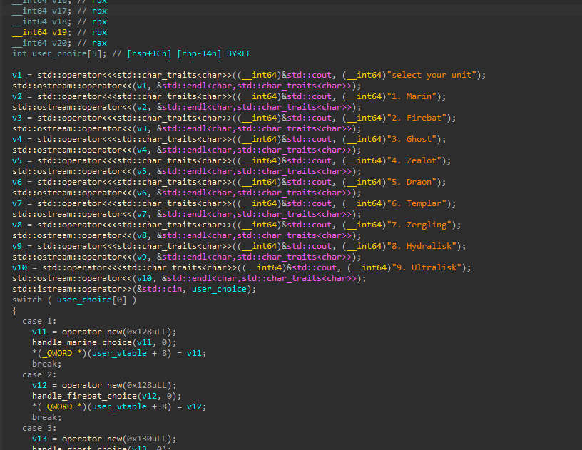

Let's return to the user allocation process.
Above, is the function called `select_user_unit`.
According to the choice of the user, an appropriate unit instance will be created.

For general reference, here is an example for a choice handling function:

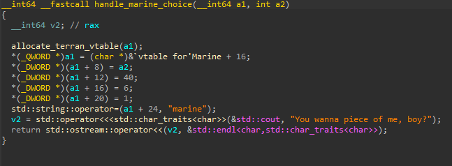

Let's continue the flow in the main function.

A for loop is entered until stage 99 is reached (nothing special happens afterwards, the game is simply over).
In the beginning of the loop, a computer unit is chosen, and both the user and the computer units are printed to the user.
This print may be valuable to leak information.

The choice of the computer unit is randomly chosen, and besides that, looks the same as the choice of the user unit.

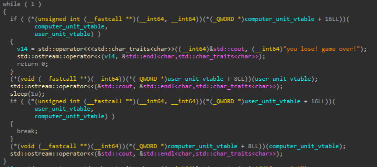

Then, a new while loop is entered which represents a fight between the user unit and the computer unit.
The computer strikes first.

Then, the user unit information is printed.

Then, the user chooses his attack option (each unit type has different options) and attacks the computer unit back.

Then, the computer unit information is printed.

The above is repeated until either the user unit wins or the computer unit wins (in which case the program is exited).

Each unit implements the attacking mechanism differently, 
but the general flow of these functions is that the default attack option is implemented in the generic `handle_fight` 
and the other attack options are handled individually.

For example:

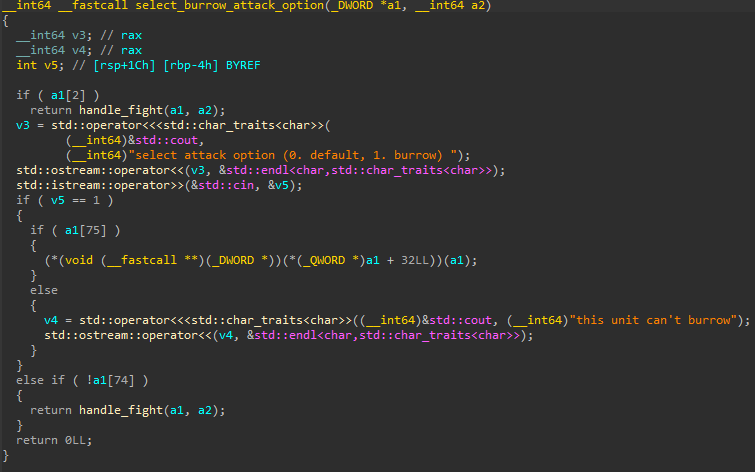

`handle_fight` prints some information to the screen and then calls the default attack option, 
which is also implemented individually for each unit.

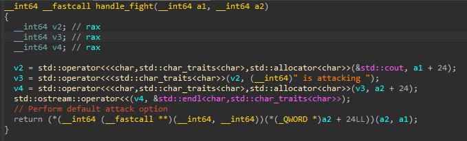

Here is an example for the default fight function (here for protoss/shield units):

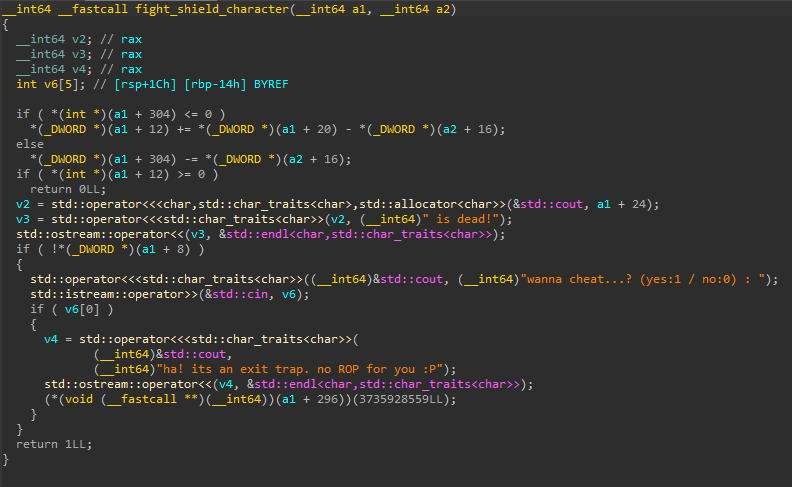

First of all, the damage is applied (either to the shield or to the HP).
If the user dies, he gets the option to cheat, which triggers the exit function.
It might be useful to use this "cheat" if we would be able to overwrite the exit function to something else.

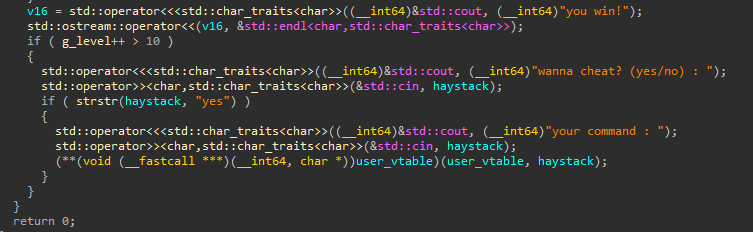

Finally, the user is also allowed to cheat if he wins and its level is bigger than 10 (more than 11 wins).
Here, the `cheat_function` will be called, with `haystack` which is controlled by the user as input argument.

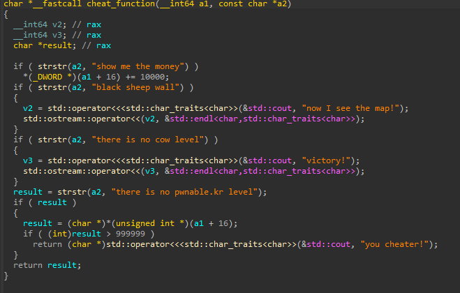

I'm not sure yet how `cheat_function` helps us.
However, since there is no validation on the input size, we can cause stack overflow after `haystack`.

In addition, I noticed that `g_level` (which is used to check if the user is allowed to cheat) is also used in a function which I encountered previously during my analysis.
This function is `get_unit_ascii_artwork`, and it exists as a method for every unit.

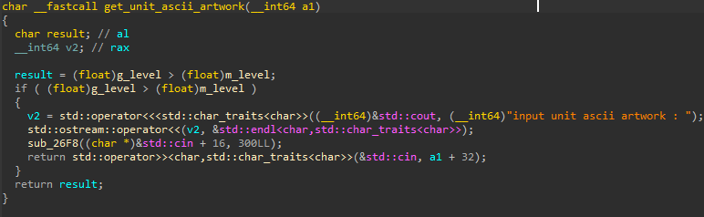

I'm not sure what it does or where it's called, except for it receiving input from the user.
The input is limited to 300 bytes, and is onto the heap, specifically onto the unit's object.
This can be interesting, potentially allowing us to overwrite data related to the units in the game.
In addition, `m_level` is a global constant that is equal to 10, 
so the validation before receiving input is similar to the one before `cheat_function`, i.e. that the level is more than 10.

Generally speaking, it looks like the challenge wants us to reach level >10.
I tried to investigate the units characteristics to understand which unit might be the strongest.

After an overview look on all the units and their abilities, 
I noticed that the templar has the ability called "arcon warp", 
which spawns a very strong arcon unit that fights for him:

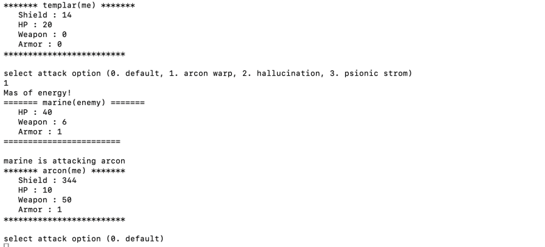

I indeed managed to progress rapidly through the stages using the arcon unit.
As we can see, the cheat prompt is opened, and we cause a stack overflow after `haystack`.
In this case, we overflow into the stack canary, hence "stack smashing detected".

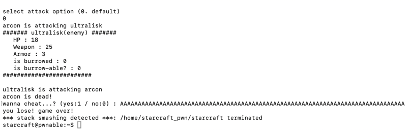

So we managed to increase levels, and we have a nice stack overflow primitive, 
but the stack canary is a problem so it's still not enough.

I continued to inspect the code.
I looked at the different attack options per unit and I noticed something strange in `select_attack_option_templar`.

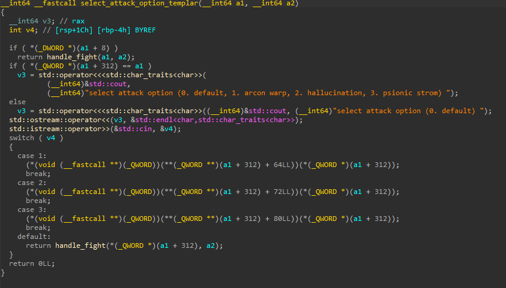

Let's remind that the templar can spawn an arcon.
As we can see, it looks like there is an if-clause that determines whether the current unit in a templar or an arcon.
The templar has 4 different attack options while the arcon has only 1.
However, the handling is exactly the same for both units, 
which means that the arcon unit can trigger some other functions when choosing an undefined attack option.
This way, it looks like the arcon unit can potentially access functions it should not be able to access.
Specifically, functions that belong to the Ultralisk unit.
Attack option 1 for Arcon will call Ultralisk's `get_unit_ascii_artwork`, 2 will call `print_burrow_unit_info`, 
and 3 will call `select_attack_option_burrow`.

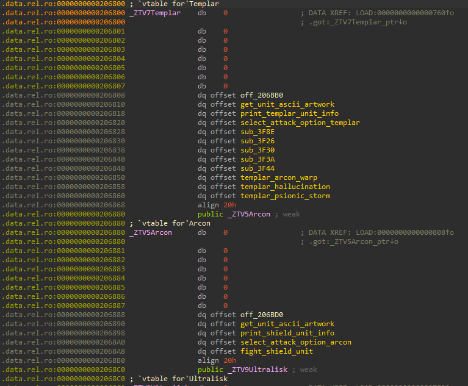

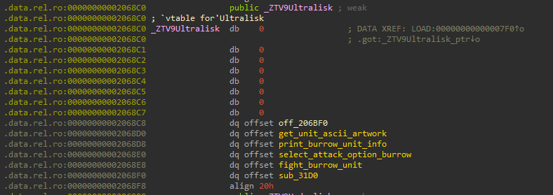

As we previously mentioned, `get_unit_ascii_artwork` looks interesting in the context of exploitation.
While it looks unused in the binary, we can trigger it using the Templar type confusion primitive presented above.
So we can overwrite some of the unit's data, but what is interesting to overwrite?
I went over my analysis and remembered the exit function, which is called when the user dies.
We can overwrite this as part of the 300 bytes, and redirect execution to something else.
It would have been useful if we could redirect execution to `system`, 
but we should leak a LIBC address in order to be able to do so.
Can the Templar type-confusion help us with this as well?
What about `print_burrow_unit_info`?

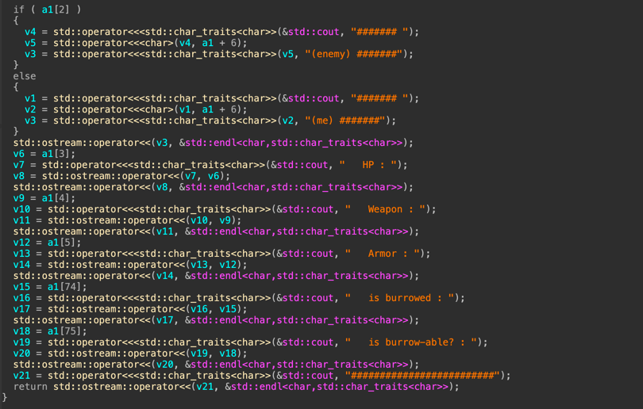

The last two prints will leak us the address of the exit function.
It works for a regular Zerg unit, but because of the type confusion primitive,
this offset stores the exit function of the Templar unit and not the actual "burrow" information.
This gives us a LIBC address leak.

So now we understood how to redirect execution to `system` and we should just handle the parameters for `system`.
We can redirect the execution using the exit callback, but then the parameters won't be according to our requirements.
What can we do to solve this?
Let's remember that we control plenty of the stack using the `haystack` buffer.
If we can direct execution to a gadget that will relocate the stack pointer to `haystack`,
we will be able to redirect execution to `system` with the desired parameters (`"/bin/sh"` which is in LIBC as well).

I found an appropriate `add rsp, 0x100` gadget in LIBC.
This redirects us, very luckily, straight to the beginning of haystack.
Now we should just need a gadget that will pop the `"/bin/sh"` pointer from the haystack to `rdi` before calling system, 
and that's it.

## Summary
1. Reach stage 12 using the Templar's unit "Arcon warp" over-powered ability.
2. Leak exit LIBC address using the Templar's type confusion primitive.
3. Using the same type confusion primitive, now activate the ASCII artwork function and overwrite the unit's callback pointer to point to a gadget that will relocate the stack to a controllable area.
4. Win another game cycle in order to reach the haystack input, which is the controllable stack area, and put the appropriate ret2libc ROP chain on the stack.
5. Continue playing until the user dies, which will trigger the exit callback, which is hijacked by us to open a shell.
6. Profit.
