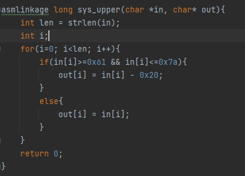

# Syscall
## Analysis
We are a given a system call implementation that converts lowercase letters to upper case letters.
We should exploit this system call to get a shell.

There is an obvious mistake in the implementation of `sys_upper`.
`sys_upper` receives a pointer to the input string as well as a pointer to the output uppercase string.
It does not perform any validation on the address of the input string.
This code runs in the Linux Kernel hence we are allowed to write anywhere in the kernel.
Our limitation is that we cannot write lowercase letters, since `sys_upper` converts anything to uppercase.

## Exploitation
So we can write non-lowercase letters to anywhere in the Linux Kernel memory space.
We should use this capability to find a way to grant ourselves root privileges.
After some Google searches, I found out that I need to run `commit_creds(prepare_kernel_cred(0))` from the kernel's context.
In order to redirect code to these functions, 
we can overwrite the syscall table (the same table that is modified in the initialization of the `sys_upper` kernel module).
We can place the addresses of these functions instead of other functions in the syscall table, 
and then when we will run these syscalls, what will actually run in `commit_creds` and `prepare_kernel_cred`.
I got the addresses of these functions from `/proc/kallsyms`.
I decided to overwrite `mkdir` and `rmdir`.
When doing the exploitation, I noticed that the address of `commit_creds` is 0x8003f56c 
and that `sys_upper` will mess this address (because 0x6c is a lowercase letter).
In order to solve this, I decided to overwrite the syscall table with a pointer to 0x8003f560 
and to overwrite the 12 bytes before 0x8003f56c with NOPs 
(I used `mov r1, r1`, I could not use `mov r0, r0` because it contained a NULL terminator).

## Exploitation Summary
1. Overwrite 12 bytes from 0x8003f560 with NOPs (NOP slide before `commit_creds`).
2. Overwrite the syscall table so that `mkdir` will point to the NOP slide and `rmdir` will point to `prepare_kernel_cred`.
3. Call `mkdir(rmdir(0))`.
4. Open a shell.
5. Profit.
