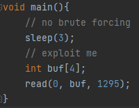
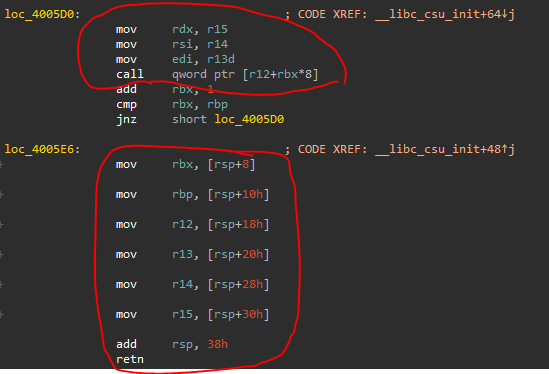
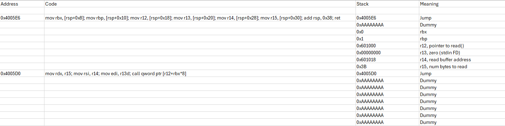
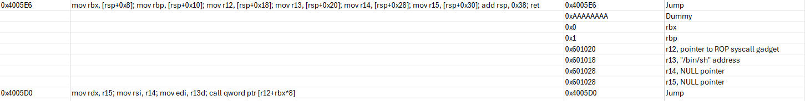

# Unexploitable
## Analysis
We are given a very short C program:

We have an obvious stack overflow primitive.
This looks like I can solve it similarly to what I did in ascii_easy, using a ROP chain,
which will implement an `execve("/bin/sh")` syscall.
In order for this to happen, we need the following things to take place:
1. `rax` should have the value `0x3B`.
2. `rdi` should contain a pointer to `"/bin/sh\0"`.
3. `rsi, rdx` should point to a NULL pointer.
4. `int 0x80`/`syscall` should be called.

I started by using the ROPGadget tool to find gadgets I can use.
Before constructing the actual shellcode, I found a gadget for `syscall`, which is "\x0f\x05", as 1295 == 0x50f 
notice the read in main, how convenient.

I started to scan for gadgets that can help me set up the registers for the syscall.
I got stuck trying to construct the ROP chain, 
especially since I did not find any gadgets that helped me control the value in rdx (we want it to point to NULL).
After some time, I decided to manually scan the binary for gadgets using IDA, 
which is not a trouble because the binary is very compact.
I found the following lines in `__libc_csu_init`:

The second gadget gives us full control over plenty of registers, which is excellent for us.
In addition, we can use the first gadget right after the second gadget, 
which will set values we control in rdx, rsi and rdi, 
which are exactly the registers we want to control before triggering the syscall.
In addition, we can cause the call in the first gadget to redirect the execution to the syscall opcode.

So we know how we want to end our ROP chain - with consecutive calls to the above two gadgets.
But we still need to prepare some stuff beforehand.
We need rsi, rdx to be NULL pointers, rdi to point to "/bin/sh\0" and rax to be 0x3b (execve syscall).
In order to have "/bin/sh\0" in an absolute address in the memory, I used the above two gadgets again,
but instead of triggering a sycsall I'll trigger the read function.
In this read operation, I'll place everything needed for the syscall in an absolute address in the memory.
As a result, the input for the additional read will be "/bin/sh\0", as well as a pointer to the syscall gadget.
In addition, we'll pad this payload with zeroes so that its length will be 0x3B.
This will cause the rax register to be 0x3B which will allow us to trigger the execve syscall afterward.
In addition, notice that we put specific values in rbx and rbp, 
in order to ensure that the ROP chain will continue after the call to the read function.

Let's summarize:

Our ROP chain will start with two gadgets that will trigger an additional read operation from stdin.
We'll input 0x3B bytes, consisting of the string "/bin/sh\0", a pointer to the syscall gadget, and padding (zeroes).
This input will be placed in an absolute address in the memory which we'll be able to reference later.

Now, all that we are left to do is to trigger the syscall gadget with appropriate pointers to the memory we have just written into in the previous read operation.

