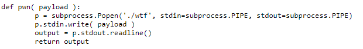

# WTF
## Analysis

We are given two files - a Python file and an executable ELF binary.
The Python runs the binary with our requested input.

The pwn function supplies the payload to the binary and returns the output:

And the MyTimer class makes sure to exit the process in case that the binary did not exit within a 5 seconds time period:

Now let's get into the binary itself.

As we can see, the binary starts with reading an int from stdin into `buffer_len`,
supposedly in order to limit the user from using more than the allocated 44 bytes for the buffer.

Then, `my_fgets` is called.

In each iteration, `my_fgets` reads a char from stdin and puts it in the buffer, until a newline char is entered.
It decrements `buffer_len` in each iteration and continues until `buffer_len` is zeroed.

Straight away, I noticed that I can cause a segmentation fault by entering a negative `buffer_len`.

I also noticed the `win` function in the binary which prints the flag.

In theory, this is a pretty straight-forward buffer overflow.
However, when I tried give the program a malicious payload, something did not work.
I used GDB and saw that every call to `read` returns 0xf7 instead of a byte from my malicious payload.

I realized that probably something causes the stdin buffer to empty between the `scanf` (for `buffer_len`) 
and the `read` in `my_fgets`.

I googled the default stdin buffer size and found that it's 4096 bytes.
I thought that maybe if I would fill the stdin buffer completely before the call to `scanf`, 
then the stdin buffer will be "refreshed" before the calls to `read` in `my_fgets`.

I constructed the payload in the following way: "-1\n" (trigger BOF) + 4093 Random bytes (will be flushed) + 
56 random bytes (padding) + call to the win function (overwrite return frame pointer of `my_fgets`).

It worked :)
